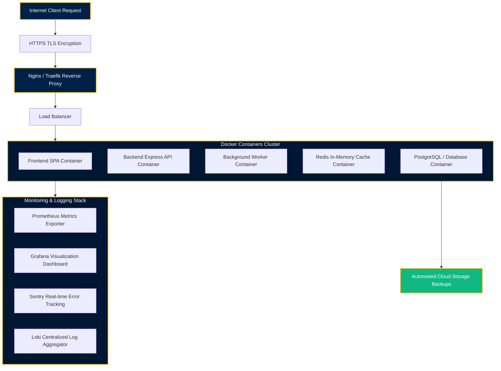

# ARCHITECTURE SPECIFICATION • 19 JHR BN NCC SBU COMPANY PORTAL

---

## 1. System Overview

The **19 JHR BN NCC • Sarala Birla University Company Portal** is designed as a high-performance single-instance full-stack web application. It combines an Express.js Node backend serving both a RESTful JSON API and real-time WebSocket channel gateway with a Vite-compiled React 18 frontend single-page application.

---

## 2. Component Layering & Subsystems

```
┌────────────────────────────────────────────────────────────────────────┐
│                        PRESENTATION LAYER (React 18)                   │
│                                                                        │
│   ┌────────────────────┐   ┌────────────────────┐   ┌──────────────┐   │
│   │ Enrollment Wizard  │   │  Cadet Dashboard   │   │ Officer UI   │   │
│   └─────────┬──────────┘   └─────────┬──────────┘   └──────┬───────┘   │
│             │                        │                     │           │
│             └────────────────────────┴─────────────────────┘           │
│                                      │                                 │
│                                      ▼                                 │
│                    ┌──────────────────────────────────┐                │
│                    │  DataPlatform SDK & Client Cache │                │
│                    └────────────────┬─────────────────┘                │
└─────────────────────────────────────┼──────────────────────────────────┘
                                      │
                         HTTP REST    │    WebSocket (/ws/v1)
                                      ▼
┌────────────────────────────────────────────────────────────────────────┐
│                         APPLICATION LAYER (Express)                    │
│                                                                        │
│   ┌────────────────────┐   ┌────────────────────┐   ┌──────────────┐   │
│   │ Rate Limiter & ID  │──►│ In-Memory Cache     │──►│ Route        │   │
│   │ Middleware         │   │ (ServerCache)      │   │ Handlers     │   │
│   └────────────────────┘   └────────────────────┘   └──────┬───────┘   │
│                                                            │           │
│             ┌──────────────────────────────────────────────┴──────┐    │
│             ▼                                                     ▼    │
│   ┌────────────────────┐                               ┌──────────┴──┐ │
│   │ Google Gen AI SDK  │                               │ SheetJS     │ │
│   │ Gemini Assistant   │                               │ XLSX Engine │ │
│   └────────────────────┘                               └─────────────┘ │
└────────────────────────────────────────────────────────────────────────┘
```

---

## 3. Core Subsystems

### 3.1. Express Server Pipeline (`server.ts`)
- **Correlation ID Middleware**: Generates unique `X-Request-ID` (`req_${timestamp}_${rand}`) headers for tracing.
- **Token Bucket Rate Limiter**: Implements IP-based tracking (`maxRequests = 120` per minute).
- **Server Cache (`ServerCache`)**: In-memory Map store with TTL invalidation. Automatically purged on write operations (POST/PATCH).

### 3.2. Real-time WebSocket Gateway (`/ws/v1`)
- **Heartbeat Protocol**: 20s server-side ping loop and client pong response for dead-connection detection and RTT latency estimation.
- **Channel Subscriptions**: Supports `cadre:notifications`, `cadre:enrollments`, `cadre:presence`, and `*` wildcard broadcasting.

### 3.3. Gemini AI Cadre Guide (`/api/v1/ai-chat`)
- **Model Escalation & Fallback**: Dual-tier evaluation attempting `gemini-3.6-flash` first, escalating to `gemini-3.1-flash-lite`, and concluding with a rule-based military fallback engine if offline.

---

## 4. Full-Stack Enterprise Infrastructure Architecture

```
Internet
    │
HTTPS (TLS)
    │
Nginx / Traefik
    │
Load Balancer
    │
Docker Containers
├── Frontend
├── Backend API
├── Worker
├── Redis
└── Database
    │
Monitoring
├── Prometheus
├── Grafana
├── Sentry
└── Loki
    │
Backups
Cloud Storage
```

### Mermaid Infrastructure Flow Diagram



---

## 5. Authorship & Maintainer

- **Author & Architect**: **Ravi Ranjan Singh**
- **Role**: Software Engineer • Software Architect • Full Stack Developer • AI SaaS Developer
- **Repository Owner**: **Ravi Ranjan Singh**
