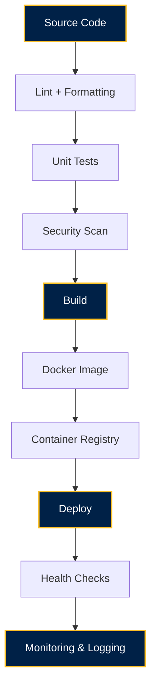

# DEPLOYMENT SPECIFICATION • 19 JHR BN NCC SBU COMPANY PORTAL

---

## 1. Overview & Release Strategy

The **19 JHR BN NCC • Sarala Birla University Company Portal** compiles into a self-contained Express backend server (`dist/server.cjs`) serving both static Vite-optimized SPA assets (`dist/index.html`, `dist/assets/*`) and REST API / WebSocket endpoints on port `3000`.

- **Target Node Version**: Node.js `^18.0.0` or `^20.0.0` (or Bun `^1.0.0`)
- **Author & Architect**: **Ravi Ranjan Singh**

---

## 2. Production Build Pipeline

To compile the application for production:

```bash
# 1. Install dependencies
npm install

# 2. Execute production build
npm run build
```

This script executes two sequential steps:
1. `vite build`: Compiles React 18 TypeScript components, Tailwind CSS v4 assets, and static files into `dist/`.
2. `esbuild server.ts`: Bundles Express, WebSockets, and Gemini AI SDK into single CommonJS file `dist/server.cjs`.

---

## 3. Production Deployment Workflows

### Option A: Standard Node.js Host (VPS / Cloud VM / Ubuntu / PM2)
```bash
# Set environment variables
export PORT=3000
export NODE_ENV=production
export GEMINI_API_KEY="your_production_gemini_key"
export APP_URL="https://ncc.sbu.ac.in"

# Start using PM2 process manager
pm2 start dist/server.cjs --name "ncc-sbu-portal"
```

### Option B: Containerized Deployment (Docker)
Create `Dockerfile`:
```dockerfile
FROM node:20-alpine AS builder
WORKDIR /app
COPY package*.json ./
RUN npm ci
COPY . .
RUN npm run build

FROM node:20-alpine AS runner
WORKDIR /app
ENV NODE_ENV=production
ENV PORT=3000
COPY --from=builder /app/package*.json ./
COPY --from=builder /app/dist ./dist
RUN npm ci --only=production
EXPOSE 3000
CMD ["node", "dist/server.cjs"]
```

Build and run container:
```bash
docker build -t ncc-sbu-portal:v3 .
docker run -d -p 3000:3000 -e GEMINI_API_KEY="your_key" ncc-sbu-portal:v3
```

---

## 4. Health Checks & Monitoring

- **Health Probe Endpoint**: `GET /api/v1/health`
  Returns `200 OK` with uptime, memory usage, and active WebSocket connection count.
- **Metrics Endpoint**: `GET /api/v1/metrics`
  Returns request counters, average latency, and cache hit ratios.

---

## 5. Rollback Strategy

If a release requires rollback:
1. Re-deploy previous release tag in Docker or process manager (`pm2 restart ncc-sbu-portal`).
2. Verify `/api/v1/health` status returns `"status": "HEALTHY"`.

---

## 7. Automated CI/CD Pipeline Flowchart

```
Source Code
     │
     ▼
Lint + Formatting
     │
     ▼
Unit Tests
     │
     ▼
Security Scan
     │
     ▼
Build
     │
     ▼
Docker Image
     │
     ▼
Container Registry
     │
     ▼
Deploy
     │
     ▼
Health Checks
     │
     ▼
Monitoring & Logging
```

### Mermaid Visual Flow Diagram



---

## 8. Authorship

- **Author & Architect**: **Ravi Ranjan Singh**
- **Role**: Software Engineer • Software Architect • Full Stack Developer • AI SaaS Developer
- **Repository Owner**: **Ravi Ranjan Singh**
