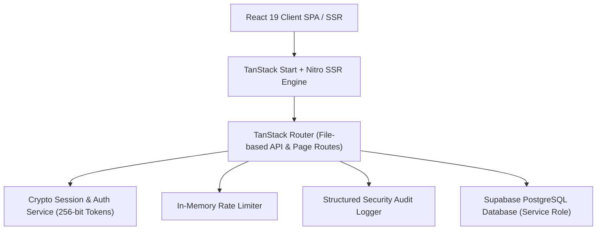

# 19 JHR BN NCC Command Centre & Cadet Portal (SBU)

> Official digital management platform for the **19 Jharkhand Battalion NCC, Sarala Birla University (SBU), Ranchi**.


---

## Technical Stack & Architecture



- **Frontend**: React 19, TanStack Router / TanStack Start, Tailwind CSS v4, Radix UI, Recharts, Motion
- **Backend / SSR**: TanStack Start SSR Handlers running on Nitro (Cloudflare Module / Node.js runtime)
- **Database**: Supabase PostgreSQL with Row Level Security (RLS)
- **Security**:
  - 256-bit cryptographically generated session tokens (`crypto.getRandomValues`)
  - Server-side HttpOnly, SameSite=Lax, Secure session cookies
  - Sliding-window rate limiting on login & OTP endpoints
  - Structured security audit logging (`audit_logs` table)
  - Automatic PII masking for Aadhaar, bank account numbers, and IFSC codes
  - PostgREST query injection sanitization

---

## Features

### Cadet Management & Enrollment
- **Cadet Enrollment Engine**: Form submission with validation (Aadhaar 12-digit, Mobile 10-digit, physical efficiency stats).
- **Public Status Tracker**: Cadets can track application status (`Submitted`, `Physical Scheduled`, `Medical Cleared`, `Selected`, `Enrolled`, `Rejected`) with masked PII protection.
- **Unit Register (Nominal Roll)**: Officer access to official unit nominal rolls (Batch-I & Batch-II).
- **Export to Excel**: One-click download of cadet enrollment data.

### Officer Command Centre
- **Cadet Database**: Full search, filter (gender, status, course, batch), and record management.
- **Officer Remarks & Status Updates**: Live status updating with audit logging.
- **Notification Broadcaster**: Send urgent notices, exam schedules, and camp updates to all cadets.
- **Security & Attack Surface Manager**: Real-time view of system security metrics, active sessions, and audit logs.

### Operations Subsystems
- **Activities Manager**: Activity lifecycle management (Planned, Approved, Active, Completed).
- **Parade & Event Calendar**: Multi-view NCC calendar system.
- **Annual Planning**: Yearly activity planner with progress tracking.
- **PI Staff Clock-In / Clock-Out**: Daily duty attendance for ANO and PI staff with server timestamps.
- **AI Cadre Guide**: Gemini-powered AI assistant for drill regulations, camp preparation, and syllabus queries.

---

## API Reference

### Authentication (`/api/v1/auth`)

| Endpoint | Method | Description | Auth Required |
|---|---|---|---|
| `/api/v1/auth/login` | POST | Authenticate officer or cadet with rate limiting | Public |
| `/api/v1/auth/logout` | POST | Terminate session and invalidate cookie | Session |
| `/api/v1/auth/me` | GET | Retrieve signed-in user session profile | Bearer / Cookie |
| `/api/v1/auth/otp/request` | POST | Request password reset OTP | Public |
| `/api/v1/auth/otp/verify` | POST | Verify OTP code and set new password | Public |

### Enrollments & Cadet Register (`/api/v1`)

| Endpoint | Method | Description | Auth Required |
|---|---|---|---|
| `/api/v1/enrollments` | GET | List all enrollments with search & filters | Officer |
| `/api/v1/enrollments` | POST | Submit new cadet enrollment application | Public |
| `/api/v1/enrollments/status/$query` | GET | Track status by SBU ID, mobile, or Aadhaar | Public (PII Masked) |
| `/api/v1/enrollments/status` | PATCH | Update enrollment status & officer remarks | Officer |
| `/api/v1/cadets` | GET | Query unit nominal rolls (cadet register) | Officer |
| `/api/v1/cadets/me` | GET | Fetch signed-in cadet's register record | Cadet |
| `/api/v1/export-excel` | GET | Download nominal roll as Excel spreadsheet | Officer |

### System & Operations (`/api/v1`)

| Endpoint | Method | Description | Auth Required |
|---|---|---|---|
| `/api/v1/health` | GET | Health check (service status, DB connectivity) | Public |
| `/api/v1/metrics` | GET | System observability metrics | Public |
| `/api/v1/notifications` | GET / POST | Fetch feed / broadcast officer notice | GET (Public) / POST (Officer) |
| `/api/v1/activities` | GET / POST | List activities / create activity | GET (Public) / POST (Officer) |
| `/api/v1/calendar` | GET / POST | Fetch calendar events / add event | GET (Public) / POST (Officer) |
| `/api/v1/annual-plans` | GET / POST | View annual plan / add plan entry | GET (Public) / POST (Officer) |
| `/api/v1/staff-attendance` | GET / POST | View attendance / clock-in/out staff | Officer |
| `/api/v1/audit` | GET | View security audit event log | Officer |
| `/api/v1/ai-chat` | POST | Query AI Cadre Guide | Session |

---

## Local Development

### Prerequisites
- Node.js >= 20.x
- npm >= 10.x

### Setup Steps

```bash
# 1. Clone repository
git clone https://github.com/Hellthefox808/NCC-CRM-V1.0.git
cd NCC-CRM-V1.0

# 2. Install dependencies
npm install

# 3. Environment configuration
cp .env.example .env
# Fill in SUPABASE_URL and SUPABASE_SERVICE_ROLE_KEY in .env

# 4. Run development server
npm run dev

# 5. Run test suite
npm test
```

---

## Docker Deployment

```bash
# Build Docker image
docker build -t ncc-portal:latest .

# Run container
docker run -d -p 3000:3000 --env-file .env --name ncc-portal ncc-portal:latest
```

Or using Docker Compose:

```bash
docker-compose up -d --build
```

---

## Production Security Guidelines

1. **Environment Variables**: Never commit `.env` or production secrets to Git.
2. **HTTPS**: Mandatory in production for Secure cookie flag enforcement.
3. **Database RLS**: All Supabase tables must keep Row Level Security enabled.
4. **Audit Log Retention**: Retain `audit_logs` records for at least 90 days for compliance audits.
