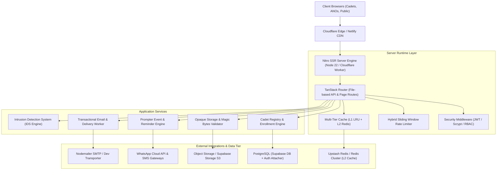
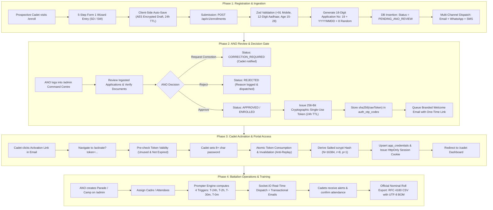

# 19 JHR BN NCC Command Centre & Cadet Portal

> Enterprise Digital Management, Cadet Enrollment & Institutional Identity Platform for **19 Jharkhand Battalion NCC, Sarala Birla University (SBU), Ranchi**.

[](https://github.com/Hellthefox808/NCC-CRM-V1.0)
[-brightgreen.svg>)](https://github.com/Hellthefox808/NCC-CRM-V1.0)
[](https://github.com/Hellthefox808/NCC-CRM-V1.0/actions)
[](https://github.com/Hellthefox808/NCC-CRM-V1.0)
[-blue.svg>)](https://www.typescriptlang.org/)
[](https://supabase.com)
[](https://19th-jh-ncc-crm-v1-0.vercel.app/)
[](https://agent-6a88700c8504a--spectacular-entremet-464b43.netlify.app/)
[](https://owasp.org/)

---

## 🌐 Live System Deployments

| Component           | Platform / Host | Live URL                                                                                                         | Description                                                 |
| :------------------ | :-------------- | :--------------------------------------------------------------------------------------------------------------- | :---------------------------------------------------------- |
| **Frontend Client** | **Vercel**      | [19th-jh-ncc-crm-v1-0.vercel.app](https://19th-jh-ncc-crm-v1-0.vercel.app/)                                      | React 19 Client SPA + TanStack Router                       |
| **Backend & SSR**   | **Netlify**     | [spectacular-entremet-464b43.netlify.app](https://agent-6a88700c8504a--spectacular-entremet-464b43.netlify.app/) | Nitro 3.0 Serverless Edge API & SSR Engine (Node.js 22 LTS) |
| **Edge Worker**     | **Cloudflare**  | `.output/server/`                                                                                                | Cloudflare Worker compatibility build                       |
| **Database**        | **Supabase**    | `qsrmzajadmmgqhfbxdwu.supabase.co`                                                                               | PostgreSQL 15 with Row-Level Security (RLS) & Prisma ORM    |

---

## 📐 Architecture Overview



### Technical Stack & Key Capabilities

- **Frontend Application**: React 19, TanStack Start, TanStack Router, Tailwind CSS v4, Radix UI, Lucide Icons, Framer Motion.
- **Backend & SSR Engine**: Nitro 3.0 + Vite 8.2 compiling unified TypeScript serverless functions across Node 22 and Cloudflare Workers.
- **Identity & Access Control**: HttpOnly Cookie Sessions (`ncc_session`), Salted `scrypt` (`N=16384, r=8, p=1`), Single-Use 256-bit SHA-256 Activation Tokens.
- **Form 1 Cadet Enrollment Engine**: 5-step wizard supporting Senior Division (`SD`) & Senior Wing (`SW`), auto-sanitizing Indian mobile numbers (`+91`), 12-digit Aadhaar validation, and 1-click Application Number copy UX.
- **18-Digit Application Number Subsystem**: Generates standard `19${YYYYMMDD}${8-digit random}` tracking numbers (e.g. `192026082163982382`).
- **Multi-Channel Notification Dispatch**: Automated dispatch across Email (Nodemailer / SMTP), WhatsApp (`+91` E.164), and SMS upon application submission, ANO approval, and event announcements.
- **Multi-Tier Cache Subsystem**: L1 In-Memory LRU Map (`< 0.05ms`) + L2 Redis (`ioredis` / Upstash REST, `1.5-3.2ms`) with synchronous dual-tier cache prefix invalidation.
- **Intrusion Detection System (IDS)**: Cumulative risk scoring engine with automated threat mitigation (`RATE_LIMIT_IP`, `REVOKE_SESSION`, `QUARANTINE_OBJECT`).
- **Database & Storage**: Supabase PostgreSQL 15 with 14 relational tables, Prisma ORM schema, idempotent migrations, and zero-leak Row-Level Security policies.
- **Export Capabilities**: RFC 4180 CSV export with UTF-8 BOM (`\uFEFF`) for seamless Microsoft Excel nominal roll generation.

---

## 🔄 Complete End-to-End System & Project Flow

The platform orchestrates a multi-role institutional workflow linking prospective applicants, enrolled cadets, Commanding Officers (ANOs), PI Staff, and administrative systems.



### 1. Form 1 Ingestion & Public Tracking Flow

1. **Applicant Entry (`/enroll`)**: The candidate enters bio-data across 5 progressive stages (Personal Details, SBU Academic Data, Physical Fitness Metrics, Bank DBT details, and Indemnity/Medical declarations).
2. **Data Cleansing & Validation**: Incoming requests are validated server-side by `cadetEnrollmentSchema`. Phone numbers with international prefixes (`+91`) and Aadhaar whitespace are sanitized.
3. **18-Digit ID Generation**: The backend generates a uniform institutional application ID conforming to `19${YYYYMMDD}${8-digit random}`.
4. **Immediate Multi-Channel Acknowledgment**:
   - **Email**: Dispatched via Nodemailer SMTP with branded HTML receipt.
   - **WhatsApp**: Dispatches official welcome template via Cloud API.
   - **SMS**: Dispatches transactional alert with tracking URL.
5. **Zero-Leak Public Status Tracking (`/api/v1/enrollments/status/:query`)**: Candidates track application progress using their 18-digit number, SBU Roll No, or registered mobile. All sensitive PII (Aadhaar, bank account numbers, IFSC, residential address) is strictly stripped before transmission.

### 2. Officer Review & Controlled Lifecycle Gate

1. **ANO Dashboard Review (`/admin`)**: Commanding Officers query nominal applications with sorting, fuzzy search, and multi-parameter filtering (by status, gender, course, selection rank).
2. **Review Action Matrix**:
   - `APPROVE`: Transitions state to `APPROVED`, registers cadet in the nominal roll, and triggers cryptographic activation issuance.
   - `REJECT`: Transitions state to `REJECTED`, records formal officer remarks, and sends rejection notice.
   - `REQUEST_CORRECTION`: Marks application as `CORRECTION_REQUIRED`, enabling applicant to update specific documents without re-registering.
3. **Single-Use Activation Security**:
   - Generates 256 bits of cryptographic entropy (`crypto.randomBytes(32)`).
   - Stores only `sha256(rawToken)` in PostgreSQL.
   - Sends the raw token exclusively in a time-limited (24-hour) activation email.

### 3. Cadet Activation, Scrypt Authentication & Portal Session

1. **Activation Gateway (`/activate`)**: Validates that the provided token exists, is unexpired, and has not been previously consumed.
2. **Atomic Token Consumption**: Invalidates the token in a single atomic transaction to prevent concurrent replay attacks.
3. **Password Security**: Hashes user password with salted `scrypt` (`N=16384, r=8, p=1`) and stores hash in `app_credentials`.
4. **Session Establishment**: Issues secure `HttpOnly; SameSite=Strict; Secure` session cookies (`ncc_session`), mitigating token theft via XSS.
5. **Cadet Portal Features (`/cadet`)**:
   - Personal bio-data card and attendance record.
   - Digital NCC ID card preview with QR verification.
   - Parade training schedules, camp circulars, and duty assignments.
   - Real-time notification tray synchronized over WebSockets (`useSocket.ts`).

### 4. Battalion Event Operations & Automated Prompter Flow

1. **Event Creation**: ANO schedules training parades, firing practice, or Annual Training Camps (ATC) with date, time, location, uniform code, and attendee cadre scope.
2. **Automated Multi-Stage Prompter Rules**: The prompter scheduler (`backend/services/prompter/`) automatically calculates and registers 4 distinct triggers:
   - **T-24 Hours**: Comprehensive event briefing email sent to all participating cadets.
   - **T-2 Hours**: WhatsApp / SMS preparation reminder with uniform and gear checklist.
   - **T-30 Minutes**: Real-time push notification & Socket.IO broadcast (`cadre:notifications`).
   - **T-0 Minutes (Event Start)**: Roll-call and digital attendance logging.
3. **Attendance Logging**: PI staff record muster roll digitally; attendance logs update cadet training profiles in real-time.

### 5. Multi-Tier Cache & High-Throughput Data Flow

1. **Request Ingestion**: Incoming API requests pass through the hybrid sliding-window rate limiter (20 requests/minute for public routes, 120 requests/minute for authenticated routes).
2. **L1 In-Memory Cache Check**: Checks local in-memory LRU cache (`< 0.05ms` latency). On hit, returns response immediately with header `X-Cache: HIT-L1`.
3. **L2 Distributed Redis Check**: On L1 miss, queries distributed Redis instance (`ioredis` or Upstash REST, `1.5-3.2ms` latency). On hit, backfills L1 and returns `X-Cache: HIT-L2`.
4. **Database Query & Cache Population**: On L2 miss, queries PostgreSQL via Supabase / Prisma connection pool, stores result in both L1 and L2 caches, and returns `X-Cache: MISS`.
5. **Synchronized Dual-Tier Invalidation**: Any write mutation (`POST`, `PUT`, `DELETE`) automatically invalidates all related cache keys and key prefixes across both L1 and L2 simultaneously.

### 6. Intrusion Detection System (IDS) Threat Flow

1. **Event Interception**: Security events (failed logins, rate limit bursts, unauthorized export attempts, magic-byte tampering) are piped to `IDSService.recordSecurityEvent()`.
2. **Dynamic Risk Scoring**: Evaluates rolling risk scores per IP and user ID (scores: `0-29: LOW`, `30-59: MEDIUM`, `60-84: HIGH`, `85+: CRITICAL`).
3. **Automated Defensive Actions**:
   - `SCORE >= 30`: Enforces temporary IP throttling via sliding-window rate limiter.
   - `SCORE >= 60`: Invalidates active session tokens and requires mandatory re-authentication.
   - `SCORE >= 85` (or unauthorized nominal export): Triggers immediate `CRITICAL` alert to ANO officers, locks account, and quarantines suspicious assets.

---

## 📋 18-Digit Application Number & Tracking Workflow

The portal issues an official 18-digit Application Number upon cadet registration:

```text
Format: 19 + [YYYYMMDD] + [8-Digit Random Number]
Example: 192026082163982382
```

1. **Submission**: Cadet completes Form 1 on [`/enroll`](https://19th-jh-ncc-crm-v1-0.vercel.app/enroll).
2. **Validation**: `cadetEnrollmentSchema` sanitizes mobile, Aadhaar, DOB (15–28 years), physical metrics, and academic profile.
3. **Dispatch**: Instant multi-channel notifications sent with tracking link (Email, WhatsApp, SMS).
4. **Public Tracking**: Status queries on `/api/v1/enrollments/status/:query` return masked PII records for security.
5. **ANO Verification**: Commanding officers review, verify documents, and issue single-use activation tokens.

---

## 🔒 Security Hardening & Authentication Architecture

### 1. Multi-Stage Cadet Provisioning Pipeline

```text
Cadet Registration ──> PENDING_ANO_REVIEW ──> Officer Approval ──> Single-Use Token
                                                                        │
                                                                        ▼
Active Cadet Session <── Scrypt Set Password <── Email Activation Link ─┘
```

- **Officer Access Gate**: Privileged endpoints strictly enforce `requireOfficer(request)` server-side.
- **Single-Use Cryptographic Tokens**: 256-bit entropy raw tokens (`crypto.randomBytes(32)`) sent via email; only `sha256(rawToken)` is stored in `account_activation_tokens`.
- **Anti-Replay Protection**: Single-use flag (`used_at`) and 24-hour expiration (`expires_at`).

### 2. Password & Identity Standards

- **Salted Scrypt Hashing**: Password hashes derived with `scrypt` using unique per-user cryptographic salts.
- **OWASP Password Standard**: Minimum 8 characters with upper, lower, numeric, and symbol enforcement.
- **Timing-Safe Responses**: Uniform messages on recovery and OTP endpoints to eliminate user enumeration vectors.

### 3. Session Security

- **Zero Client Token Storage**: Session tokens are not stored in `localStorage` or `sessionStorage` to mitigate XSS attacks.
- **HttpOnly Cookie Handling**: Auth middleware extracts tokens from `HttpOnly; SameSite=Strict; Secure` cookies.

---

## 📁 Repository Documentation Matrix

Detailed architecture and operations guides are located in the [`docs/`](file:///c:/Users/ravir/Desktop/PROJECT/Project/NCC/docs/) directory:

| Document                                                                                                              | Description                                                                          |
| :-------------------------------------------------------------------------------------------------------------------- | :----------------------------------------------------------------------------------- |
| **[`docs/ARCHITECTURE.md`](file:///c:/Users/ravir/Desktop/PROJECT/Project/NCC/docs/ARCHITECTURE.md)**                 | Technical topology, Nitro SSR server architecture, and security boundaries.          |
| **[`docs/DATABASE.md`](file:///c:/Users/ravir/Desktop/PROJECT/Project/NCC/docs/DATABASE.md)**                         | Complete database schema, 14 tables, ERD, SQL migrations, and RLS policies.          |
| **[`docs/PROJECT-CONTEXT.md`](file:///c:/Users/ravir/Desktop/PROJECT/Project/NCC/docs/PROJECT-CONTEXT.md)**           | System architecture, component stacks, and operational boundaries.                   |
| **[`docs/TEST-MATRIX.md`](file:///c:/Users/ravir/Desktop/PROJECT/Project/NCC/docs/TEST-MATRIX.md)**                   | Comprehensive test matrix of all 60 automated unit, integration, and security tests. |
| **[`docs/REDIS-MODEL.md`](file:///c:/Users/ravir/Desktop/PROJECT/Project/NCC/docs/REDIS-MODEL.md)**                   | Multi-tier caching architecture and hybrid rate limiting specification.              |
| **[`docs/PRODUCTION-READINESS.md`](file:///c:/Users/ravir/Desktop/PROJECT/Project/NCC/docs/PRODUCTION-READINESS.md)** | Production deployment attestation and environment checklist.                         |

---

## 🚀 Quick Start Guide

### Prerequisites

- **Node.js**: `>= 22.0.0` (LTS)
- **npm**: `>= 10.0.0`
- **Docker & Docker Compose** _(Optional, for containerized run)_

### 1. Local Setup

```bash
# Clone the repository
git clone https://github.com/Hellthefox808/NCC-CRM-V1.0.git
cd NCC-CRM-V1.0

# Install dependencies
npm install

# Copy environment template
cp .env.example .env

# Configure Supabase credentials in .env
```

### 2. Start Development Server

```bash
npm run dev
```

Application will be accessible at `http://localhost:3000`.

### 3. Run Automated Tests

```bash
# Execute full test suite (60 tests across 11 suites)
npm run test
```

### 4. Build Production Bundle

```bash
npm run build
```

---

## ⚙️ Environment Variables Reference

| Variable Name               | Required | Default / Example                          | Purpose                                         |
| :-------------------------- | :------: | :----------------------------------------- | :---------------------------------------------- |
| `NODE_ENV`                  |   Yes    | `development` / `production`               | Application execution environment               |
| `PORT`                      |    No    | `3000`                                     | HTTP server listening port                      |
| `VITE_SUPABASE_URL`         |   Yes    | `https://qsrmzajadmmgqhfbxdwu.supabase.co` | Public Supabase API Endpoint                    |
| `VITE_SUPABASE_ANON_KEY`    |   Yes    | `eyJhbGciOi...`                            | Supabase Anonymous Client Key                   |
| `SUPABASE_SERVICE_ROLE_KEY` |   Yes    | `eyJhbGciOi...`                            | Supabase Service Role Key (Backend Server Only) |
| `REDIS_URL`                 | Optional | `redis://localhost:6379`                   | Connection URL for Local / Docker TCP Redis     |
| `UPSTASH_REDIS_REST_URL`    | Optional | `https://...upstash.io`                    | Upstash Redis REST URL for Serverless Edge      |
| `UPSTASH_REDIS_REST_TOKEN`  | Optional | `AXXX...`                                  | Upstash Redis REST API Authorization Token      |
| `JWT_SECRET`                |   Yes    | `min-32-character-secret`                  | 256-bit secret for signing user auth tokens     |
| `SESSION_SECRET`            |   Yes    | `session-encryption-secret`                | Encryption key for cookie-based session state   |
| `SMTP_HOST`                 | Optional | `smtp.gmail.com`                           | Host for email notification server              |
| `SMTP_PORT`                 | Optional | `587`                                      | Port for SMTP mailer connection                 |
| `SMTP_USER`                 | Optional | `user@sbu.ac.in`                           | SMTP authentication user                        |
| `SMTP_PASS`                 | Optional | `app-password`                             | SMTP authentication password                    |

---

## 🐳 Docker & Containerization

The repository includes a production multi-container setup with `ncc-app` and `redis`:

```bash
# Build and run containers in detached mode
docker-compose up -d --build

# Check container status
docker-compose ps

# View real-time logs
docker-compose logs -f
```

---

## 📋 Key API Endpoints Matrix

| Category          | Endpoint                                          | Method     | Access           | Description                                          |
| :---------------- | :------------------------------------------------ | :--------- | :--------------- | :--------------------------------------------------- |
| **System**        | `/api/v1/health`                                  | GET        | Public           | System health check & memory/redis metrics           |
| **Auth**          | `/api/v1/auth/login`                              | POST       | Public           | User authentication with rate limiting               |
| **Auth**          | `/api/v1/auth/me`                                 | GET        | Session          | Retrieve active user session profile                 |
| **Auth**          | `/api/v1/auth/activate`                           | POST       | Public           | Validate single-use activation token                 |
| **Auth**          | `/api/v1/auth/set-password`                       | POST       | Public           | Set password & activate cadet account                |
| **Auth**          | `/api/v1/auth/otp/request`                        | POST       | Public           | Request OTP for authentication/recovery              |
| **Auth**          | `/api/v1/auth/otp/verify`                         | POST       | Public           | Verify OTP code                                      |
| **Auth**          | `/api/v1/auth/forgot-password`                    | POST       | Public           | Request password reset link                          |
| **Enrollment**    | `/api/v1/enrollments`                             | POST / GET | Public / Officer | Submit Form 1 application / list enrollments         |
| **Enrollment**    | `/api/v1/enrollments/status/$query`               | GET        | Public           | Track application status (PII masked)                |
| **ANO Review**    | `/api/v1/ano/applications/$id/approve`            | POST       | Officer          | Approve application & issue activation token         |
| **ANO Review**    | `/api/v1/ano/applications/$id/reject`             | POST       | Officer          | Reject application with reason                       |
| **ANO Review**    | `/api/v1/ano/applications/$id/request-correction` | POST       | Officer          | Request correction from applicant                    |
| **Cadets**        | `/api/v1/cadets`                                  | GET        | Officer          | Query unit nominal rolls & roster                    |
| **Export**        | `/api/v1/export-excel`                            | GET        | Officer          | Export official nominal roll CSV/Excel               |
| **Operations**    | `/api/v1/activities`                              | GET / POST | Public / Officer | Manage battalion activities                          |
| **Operations**    | `/api/v1/calendar`                                | GET / POST | Public / Officer | Manage parade & event calendar                       |
| **Operations**    | `/api/v1/calendar/$id/publish`                    | POST       | Officer          | Publish calendar event to cadets                     |
| **Operations**    | `/api/v1/calendar/$id/cancel`                     | POST       | Officer          | Cancel calendar event                                |
| **Operations**    | `/api/v1/calendar/$id/reminders`                  | POST       | Officer          | Schedule automated reminders                         |
| **Notifications** | `/api/v1/notifications`                           | GET / POST | Cadet / Officer  | Notification feed and broadcast                      |
| **Notifications** | `/api/v1/notifications/$id/read`                  | POST       | Cadet            | Mark notification as read                            |
| **Storage**       | `/api/v1/storage/intent`                          | POST       | Authenticated    | Create pre-signed upload intent                      |
| **Storage**       | `/api/v1/storage/token`                           | POST       | Authenticated    | Generate download token with magic byte verification |

---

## 🧪 Testing & Quality Assurance

```bash
# Execute unit & integration test suite (60/60 passing, 100%)
npm test

# Run ESLint analysis (0 errors)
npm run lint

# Run TypeScript type safety verification (0 errors)
npx tsc --noEmit

# Format codebase with Prettier
npm run format
```

---

## 📜 License & Compliance

Maintained for the **19 Jharkhand Battalion NCC (Sarala Birla University Sub-Unit)**.  
Engineered in accordance with institutional security protocols, OWASP ASVS 5.0 Level 2, and Supabase RLS standards.
