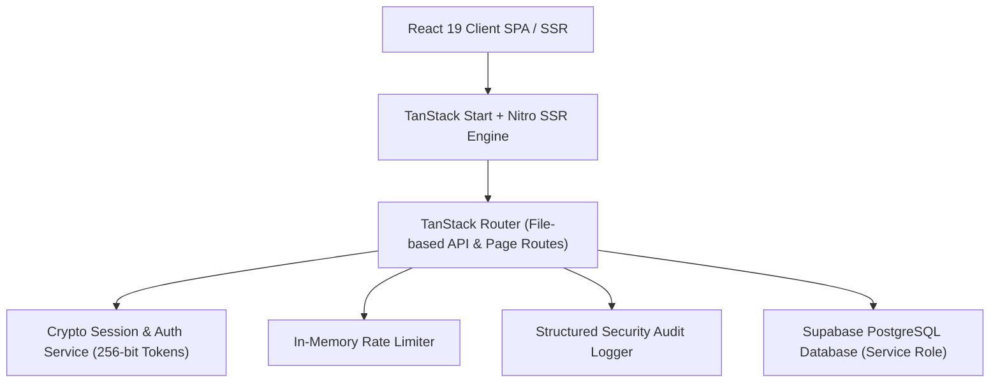

# 19 JHR BN NCC Command Centre & Cadet Portal

> Enterprise digital management platform for **19 Jharkhand Battalion NCC, Sarala Birla University (SBU), Ranchi**.


---

## Architecture Overview



### Technical Stack

- **Frontend**: React 19, TanStack Start, TanStack Router, Tailwind CSS v4, Radix UI, Lucide Icons, Framer Motion
- **Backend / SSR**: TanStack Start API Routes running on Nitro Engine (Cloudflare Workers / Node.js)
- **Database**: Supabase PostgreSQL with Row Level Security (RLS) & Automated Audit Logging
- **Testing & CI**: Native Node.js Test Runner with `tsx`, GitHub Actions Enterprise CI Pipeline

---

## Core Capabilities

### 🪖 Cadet Portal & Enrollment

- **Enrollment Engine**: Application submission with validation (Aadhaar, Mobile, Physical Stats, SBU Roll No).
- **Public Status Tracker**: Real-time status lookup with automatic PII masking (Aadhaar & Bank details).
- **Nominal Roll Register**: Centralized unit roster management for Batch-I & Batch-II cadets.
- **Excel Data Export**: One-click nominal roll export for official battalion records.

### 🛡️ Officer Command Centre

- **Cadet Database**: Advanced search, filtering by batch/course/gender, and record updates.
- **Notification Broadcaster**: Battalion-wide announcements, exam schedules, and camp updates.
- **PI Staff Attendance**: Digital clock-in/out tracking with server timestamps for ANO & PI staff.
- **Security & Observability**: Real-time audit logs, active session tracking, and rate-limiting metrics.

### 🎯 Operations & Cadre Guide

- **Activities & Calendar**: Activity lifecycle tracking (Planned, Active, Completed) and event scheduling.
- **Annual Planning**: Master yearly calendar with monthly milestones.
- **AI Cadre Assistant**: Gemini-powered guide for NCC drill regulations, camp prep, and exam syllabus.

---

## Key API Endpoints

| Category       | Endpoint                            | Method     | Access           | Description                           |
| -------------- | ----------------------------------- | ---------- | ---------------- | ------------------------------------- |
| **Auth**       | `/api/v1/auth/login`                | POST       | Public           | Authenticate user with rate limiting  |
| **Auth**       | `/api/v1/auth/me`                   | GET        | Session          | Get signed-in user session profile    |
| **Auth**       | `/api/v1/auth/otp/request`          | POST       | Public           | Request password reset OTP            |
| **Enrollment** | `/api/v1/enrollments`               | POST / GET | Public / Officer | Submit application / list enrollments |
| **Enrollment** | `/api/v1/enrollments/status/$query` | GET        | Public           | Track application status (PII masked) |
| **Cadets**     | `/api/v1/cadets`                    | GET        | Officer          | Query unit nominal rolls              |
| **Export**     | `/api/v1/export-excel`              | GET        | Officer          | Download nominal roll Excel sheet     |
| **Operations** | `/api/v1/activities`                | GET / POST | Public / Officer | Manage battalion activities           |
| **Operations** | `/api/v1/calendar`                  | GET / POST | Public / Officer | Manage parade & event calendar        |
| **Operations** | `/api/v1/staff-attendance`          | GET / POST | Officer          | PI staff duty clock-in/out            |

---

## Quick Start

### Prerequisites

- **Node.js**: `>= 22.0.0`
- **npm**: `>= 10.0.0`

### Local Setup

```bash
# 1. Clone repo
git clone https://github.com/Hellthefox808/NCC-CRM-V1.0.git
cd NCC-CRM-V1.0

# 2. Install dependencies
npm install

# 3. Configure Environment
cp .env.example .env

# 4. Start Development Server
npm run dev

# 5. Run Test Suite
npm test
```

### Docker Deployment

```bash
# Build & Run via Docker Compose
docker-compose up -d --build
```

---

## License & Operational Compliance

Maintained for the **19 Jharkhand Battalion NCC (Sarala Birla University Unit)**. Managed in accordance with institutional security guidelines and Supabase RLS row-level security protocols.
