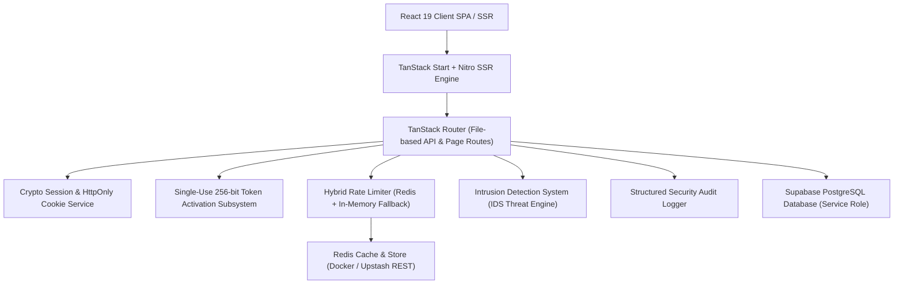

# 19 JHR BN NCC Command Centre & Cadet Portal

> Enterprise Digital Management & Institutional Identity Subsystem for **19 Jharkhand Battalion NCC, Sarala Birla University (SBU), Ranchi**.


---

## 📐 Architecture Overview



### Technical Stack

- **Frontend**: React 19, TanStack Start, TanStack Router, Tailwind CSS v4, Radix UI, Lucide Icons, Framer Motion
- **Backend / SSR**: TanStack Start API Routes running on Nitro Engine (Node.js / Cloudflare Workers / Vercel Serverless)
- **Identity & Security**: HttpOnly Cookie Sessions (`ncc_session`), Salted `scrypt` Password Hashing (`N=16384, r=8, p=1`), Single-Use SHA-256 Hashed Activation Tokens, Intrusion Detection System (IDS)
- **Database**: Supabase PostgreSQL with Row Level Security (RLS) & Automated Audit Logging
- **Caching & Rate Limiting**: Redis 7 (Local/Docker) & Upstash Redis REST (Cloud Serverless) with graceful In-Memory Fallback
- **Export Engine**: Zero-Dependency RFC 4180 CSV Generator with UTF-8 BOM (`\uFEFF`) for native Microsoft Excel compatibility
- **Deployment**: Docker & Docker Compose, Vercel Serverless Platform
- **Testing & CI**: Native Node.js Test Runner with `tsx` & GitHub Actions CI

---

## 🔒 Security Hardening & Identity Architecture

### 1. Controlled Cadet Provisioning & Single-Use Activation
- **ANO Approval Gate**: Privileged operations strictly enforce `requireOfficer(request)` server-side.
- **Single-Use 256-Bit Cryptographic Secrets**: Activation links utilize 256-bit entropy raw tokens (`crypto.randomBytes(32)`). Raw tokens are sent via email; only `sha256(rawToken)` is stored in `account_activation_tokens`.
- **Expiration & Anti-Replay**: Activation tokens enforce single-use (`used_at`) and 24-hour TTL (`expires_at`).
- **Asynchronous Outbox Email Dispatch**: Email jobs are processed asynchronously via `queueEmailJob()`, preventing ANO approval database transactions from blocking on external SMTP latency.

### 2. Password Security & Anti-Enumeration
- **Salted Scrypt Hashing**: Password hashes are derived using `scrypt` (`N=16384, r=8, p=1`) with unique per-user salts (`hashPassword`).
- **Strict Password Length Floor**: Minimum 8-character (up to 128-character) floor enforced via Zod `strongPasswordSchema`.
- **Anti-Enumeration Protection**: Forgotten password and OTP request endpoints return generic timing-consistent responses (`If this account exists...`) to prevent email/username harvesting.

### 3. HttpOnly Session Security
- **Zero Client Token Storage**: Session tokens are stripped from `sessionStorage` and `localStorage` to prevent XSS credential theft.
- **HttpOnly Cookie Handling**: `bearer()` extracts tokens from `Authorization: Bearer` headers or `HttpOnly; SameSite=Lax; Secure` `ncc_session` cookies.

### 4. Intrusion Detection System (IDS)
- **Real-Time Event Correlation**: Normalizes security events (`AUTH_FAILURE`, `IDOR_ATTEMPT`, `UNAUTHORIZED_EXPORT`, `STORAGE_TOKEN_REPLAY`).
- **Risk Score Accumulation & Automated Containment**: Triggers alerts (`LOW`, `MEDIUM`, `HIGH`, `CRITICAL`) and automated containment actions (`RATE_LIMIT_IP`, `REVOKE_SESSION`, `QUARANTINE_OBJECT`).

---

## 🔒 GitHub Repository Hygiene

The repository is pre-configured with a comprehensive `.gitignore`. The following files **MUST NEVER** be pushed to GitHub:

| Category             | File Patterns / Folders                                           | Reason                                               |
| :------------------- | :---------------------------------------------------------------- | :--------------------------------------------------- |
| **Secrets & Keys**   | `.env`, `.env.local`, `.dev.vars`, `*.pem`, `*.key`               | Contains private Supabase, JWT, and SMTP credentials |
| **Dependencies**     | `node_modules/`, `.pnpm-store/`                                   | Large generated package directories                  |
| **Build Artifacts**  | `dist/`, `.output/`, `.tanstack/`, `.next/`, `.vercel/`           | Local build outputs generated on build server        |
| **Tooling & Caches** | `.jolli/`, `.lovable/`, `.nex/`, `.gemini/`, `.system_generated/` | Temporary CLI and AI workspace caches                |
| **Logs & Backups**   | `logs/`, `*.log`, `*.sqlite`, `*.db`, `backups/`                  | Runtime logs and local database dumps                |

---

## 🚀 Quick Start Guide

### Prerequisites

- **Node.js**: `>= 22.0.0`
- **npm**: `>= 10.0.0`
- **Docker & Docker Compose** _(Optional, for containerized run)_

### 1. Local Setup

```bash
# Clone the repository
git clone https://github.com/Hellthefox808/NCC-CRM-V1.0.git
cd NCC-CRM-V1.0

# Install dependencies
npm install

# Copy environment template
cp .env.example .env

# Edit .env and supply your Supabase & Secret credentials
```

### 2. Start Development Server

```bash
npm run dev
```

The application will be accessible at `http://localhost:3000`.

### 3. Run Test Suite

```bash
npm test
```

---

## ⚙️ Environment Variables Reference

| Variable Name               | Required | Default / Example                  | Purpose                                         |
| :-------------------------- | :------: | :--------------------------------- | :---------------------------------------------- |
| `NODE_ENV`                  |   Yes    | `development` / `production`       | Application execution environment               |
| `PORT`                      |    No    | `3000`                             | HTTP server listening port                      |
| `VITE_SUPABASE_URL`         |   Yes    | `https://your-project.supabase.co` | Public Supabase API Endpoint                    |
| `VITE_SUPABASE_ANON_KEY`    |   Yes    | `eyJhbGciOi...`                    | Supabase Anonymous Client Key                   |
| `SUPABASE_SERVICE_ROLE_KEY` |   Yes    | `eyJhbGciOi...`                    | Supabase Service Role Key (Backend Server Only) |
| `REDIS_URL`                 | Optional | `redis://localhost:6379`           | Connection URL for Local / Docker TCP Redis     |
| `UPSTASH_REDIS_REST_URL`    | Optional | `https://...upstash.io`            | Upstash Redis REST URL for Vercel Serverless    |
| `UPSTASH_REDIS_REST_TOKEN`  | Optional | `AXXX...`                          | Upstash Redis REST API Authorization Token      |
| `JWT_SECRET`                |   Yes    | `min-32-character-secret`          | 256-bit secret for signing user auth tokens     |
| `SESSION_SECRET`            |   Yes    | `session-encryption-secret`        | Encryption key for cookie-based session state   |
| `SMTP_HOST`                 | Optional | `smtp.gmail.com`                   | Host for email notification server              |
| `SMTP_PORT`                 | Optional | `587`                              | Port for SMTP mailer connection                 |
| `SMTP_USER`                 | Optional | `user@sbu.ac.in`                   | SMTP authentication user                        |
| `SMTP_PASS`                 | Optional | `app-password`                     | SMTP authentication password                    |

---

## 🐳 Docker & Docker Compose Deployment

The project includes a multi-container Docker configuration with `ncc-app` and a persistent `redis` service.

```bash
# Build and run containers in detached mode
docker-compose up -d --build

# Check container status
docker-compose ps

# View real-time logs
docker-compose logs -f
```

---

## 🌐 Vercel Deployment Guide

1. Log in to [Vercel Dashboard](https://vercel.com).
2. Import the `NCC-CRM-V1.0` repository.
3. Configure settings specified in `vercel.json` (Framework: Vite, Build: `npm run build`, Output: `.output/public`).
4. Set required Environment Variables (`VITE_SUPABASE_URL`, `SUPABASE_SERVICE_ROLE_KEY`, `SESSION_SECRET`, `UPSTASH_REDIS_REST_URL`).
5. Click **Deploy**.

---

## 🔴 Redis Caching & Rate Limiting Architecture

The platform features a resilient **Dual-Mode Redis Client** (`backend/lib/redis.server.ts`):
1. **Cloud Serverless Mode**: Used when `UPSTASH_REDIS_REST_URL` & `UPSTASH_REDIS_REST_TOKEN` are set.
2. **Container / Local Mode**: Used when `REDIS_URL` is configured.
3. **Automatic In-Memory Fallback**: If Redis is not configured, rate limiting falls back to an in-memory sliding window algorithm.

---

## 📋 Key API Endpoints Matrix

| Category       | Endpoint                            | Method     | Access           | Description                           |
| :------------- | :---------------------------------- | :--------- | :--------------- | :------------------------------------ |
| **System**     | `/api/v1/health`                    | GET        | Public           | System health check & Redis status    |
| **Auth**       | `/api/v1/auth/login`                | POST       | Public           | User authentication with rate limit   |
| **Auth**       | `/api/v1/auth/me`                   | GET        | Session          | Retrieve active user session profile  |
| **Auth**       | `/api/v1/auth/activate`             | POST       | Public           | Validate single-use activation token  |
| **Auth**       | `/api/v1/auth/set-password`         | POST       | Public           | Set password & activate cadet account |
| **Auth**       | `/api/v1/auth/otp/request`          | POST       | Public           | Request OTP for authentication/reset  |
| **Enrollment** | `/api/v1/enrollments`               | POST / GET | Public / Officer | Submit application / list enrollments |
| **Enrollment** | `/api/v1/enrollments/status/$query` | GET        | Public           | Track application status (PII masked) |
| **ANO Review** | `/api/v1/ano/applications/$id/approve` | POST   | Officer          | Approve application & issue activation |
| **Cadets**     | `/api/v1/cadets`                    | GET        | Officer          | Query unit nominal rolls & roster     |
| **Export**     | `/api/v1/export-excel`              | GET        | Officer          | Export official nominal roll CSV/Excel|
| **Operations** | `/api/v1/activities`                | GET / POST | Public / Officer | Manage battalion activities           |
| **Operations** | `/api/v1/calendar`                  | GET / POST | Public / Officer | Manage parade & event calendar        |

---

## 🧪 Testing & Verification

The project enforces native testing and static analysis:

```bash
# Execute unit test suite (41 tests across 6 modules)
npm test

# Run ESLint analysis
npm run lint

# Format codebase with Prettier
npm run format
```

---

## 📜 License & Compliance

Maintained for the **19 Jharkhand Battalion NCC (Sarala Birla University Unit)**. Managed in accordance with institutional security guidelines, OWASP API Security Top 10, and Supabase RLS protocols.
