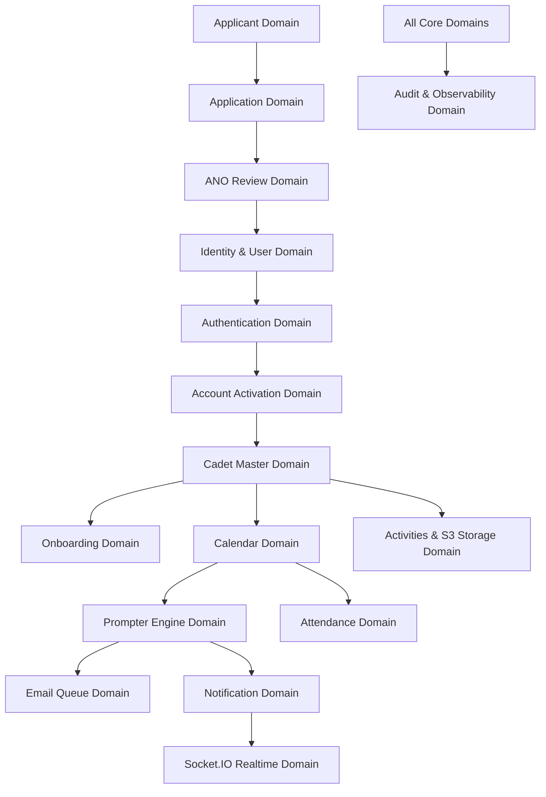

# Domain Model Specification (Phase 01)

**System**: 19 Jharkhand Battalion NCC Cadre & Command Portal  
**Document Version**: 1.0.0  
**Phase**: Phase 01 — Architecture + Domain Model

---

## 1. Explicit Domain Boundaries & Ownership

The system is decomposed into 21 explicit domain boundaries with zero cross-domain state leakage.

| Domain                   | Boundary Responsibilities                                                | Primary Data Owners (Tables)                             | Authorized Roles                                             |
| ------------------------ | ------------------------------------------------------------------------ | -------------------------------------------------------- | ------------------------------------------------------------ |
| **Identity & Users**     | User accounts, credentials, role assignments                             | `users`, `user_roles`, `cadet_users`                     | `SUPER_ADMIN`, System Auth                                   |
| **Authentication**       | Login, password hashing (scrypt), token verification, session tracking   | `sessions`, `account_activation_tokens`                  | All Users (Unauthenticated for login/activation)             |
| **Applicants**           | External enrollment interest, pre-qualification inputs                   | `cadet_enrollments`                                      | Public / Applicant                                           |
| **Applications**         | Formal cadet application lifecycle, document attachments                 | `cadet_enrollments`, `application_documents`             | Applicant, ANO                                               |
| **ANO Review**           | Official verification, approval, rejection, correction request workflows | `cadet_enrollments`, `application_reviews`               | `ANO`, `SUPER_ADMIN`                                         |
| **Cadets**               | Activated cadet master records, ranks, sub-unit assignments              | `cadets`, `cadet_profiles`, `cadet_academics`            | `ANO`, `PI_STAFF`, `INSTRUCTOR`, `CADET` (self-view)         |
| **Cadet Identity & PII** | Sensitive identifiers (Aadhaar, DOB, Bank Details)                       | `cadet_identity`, `cadet_financial`                      | `ANO` (restricted), `SUPER_ADMIN`                            |
| **Onboarding**           | Post-activation orientation, rule acceptance, profile verification       | `onboarding_progress`                                    | `CADET` (self), `ANO`                                        |
| **Calendar**             | Training schedules, parades, camps, event statuses                       | `calendar_events`, `calendar_event_attendees`            | `ANO`, `PI_STAFF`, `INSTRUCTOR` (read-write); `CADET` (read) |
| **Attendance**           | Parade & event clock-in/out, staff duty logs                             | `attendance`, `staff_attendance`                         | `PI_STAFF`, `INSTRUCTOR`, `ANO`                              |
| **Activities**           | Special events, camps, achievements, gallery photos                      | `activities`, `activity_participants`, `activity_photos` | `ANO`, `PI_STAFF`, `CADET`                                   |
| **Documents**            | S3 object presigned URLs, MIME validation, storage tracking              | `application_documents`, `activity_photos`               | Document Owner, `ANO`                                        |
| **Notifications**        | Multi-channel in-app, email, and realtime notifications                  | `notifications`, `notification_deliveries`               | System, Recipient                                            |
| **Email Service**        | Queued Nodemailer dispatches, SMTP worker executions                     | `email_jobs`, `email_deliveries`                         | System Email Worker                                          |
| **Prompter**             | Durable event reminder Engine (24h, 2h, 30m, Live triggers)              | `prompter_rules`, `prompter_jobs`                        | System Scheduler                                             |
| **Realtime Engine**      | Socket.IO room subscriptions (`user:{id}`, `role:{role}`)                | In-Memory Socket Server                                  | Authenticated Socket Clients                                 |
| **AI Gateway & RAG**     | Vector knowledge base, policy query assistant, prompt sanitization       | AI Knowledge Collections                                 | Authenticated Users                                          |
| **Audit Logging**        | Security event auditing, data access tracking, immutable logs            | `audit_logs`, `security_events`                          | `SUPER_ADMIN`, SRE                                           |
| **Reports & Exports**    | Nominal rolls, attendance summaries, training metrics                    | Dynamic DB Aggregations                                  | `ANO`, `PI_STAFF`                                            |
| **System Settings**      | Platform configuration, feature toggles, maintenance state               | `system_settings`, `feature_flags`                       | `SUPER_ADMIN`                                                |

---

## 2. State Machines

### A. Cadet Application Lifecycle State Machine

```text
   [ DRAFT ]
       │
    submit()
       ▼
 [ SUBMITTED / PENDING_ANO_REVIEW ] ◄───────┐
       │                                     │
       ├───────────────┬─────────────────┐   │ resubmit()
       ▼               ▼                 ▼   │
 [ APPROVED ]   [ REJECTED ]   [ CORRECTION_REQUIRED ]
       │
  createAccount()
       ▼
 [ ACTIVATION_PENDING ]
```

### B. User Account & Activation State Machine

```text
 [ ACTIVATION_PENDING ]
       │
  issueActivationToken()
       ▼
 [ TOKEN_ISSUED ] ──► Expiry (>24h) / Invalidated ──► [ EXPIRED_TOKEN ]
       │
  verifyToken() & setPassword()
       ▼
 [ ACTIVATED / ACTIVE ]
       │
       ├─────────────────┐
  disableAccount()  revokeSession()
       ▼                 ▼
 [ DISABLED ]     [ LOGGED_OUT ]
```

### C. Calendar Event Lifecycle State Machine

```text
   [ DRAFT ]
       │
   publish()
       ▼
  [ PUBLISHED ] ──────► reschedule() ──► [ RESCHEDULED ]
       │                                      │
       ├─────────────────┬────────────────────┘
   cancel()           complete()
       ▼                 ▼
 [ CANCELLED ]     [ COMPLETED ]
```

### D. File Upload Lifecycle State Machine

```text
 [ INTENT_REGISTERED ]
       │
  generatePresignedUrl()
       ▼
  [ UPLOADING ]
       │
  verifyChecksumAndMagicBytes()
       ├─────────────────────────┐
    valid                     invalid
       ▼                         ▼
  [ UPLOADED / VERIFIED ]   [ QUARANTINED / DELETED ]
```

---

## 3. Domain Dependency Graph



---

## 4. Phase 01 Completion Verification

- **Domain Boundaries**: Defined 21 explicit domains with exact database ownership.
- **State Machines**: Formally specified Application, Account Activation, Calendar Event, and File Upload state transitions.
- **Dependency Graph**: Documented directional dependency flow preventing circular dependencies.
- **ADR Record**: Documented in `ADR-010-domain-boundaries-state-machines.md`.
