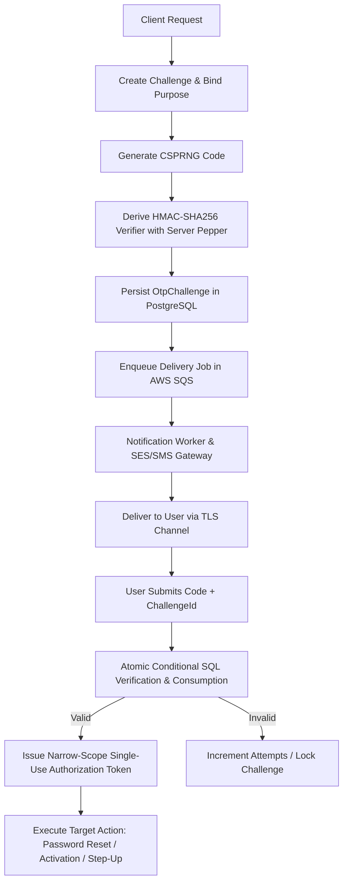
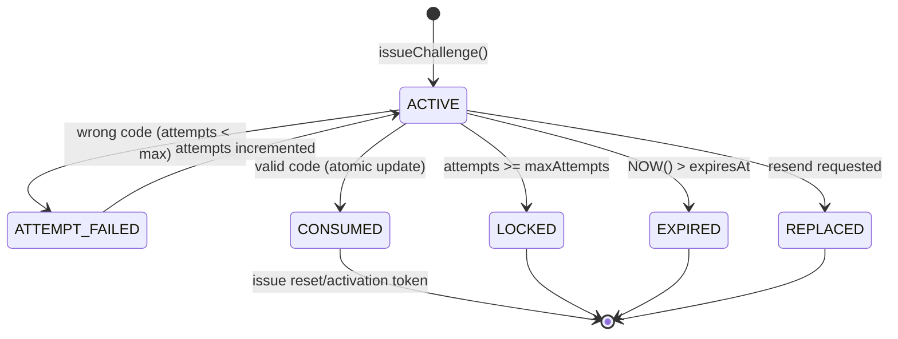
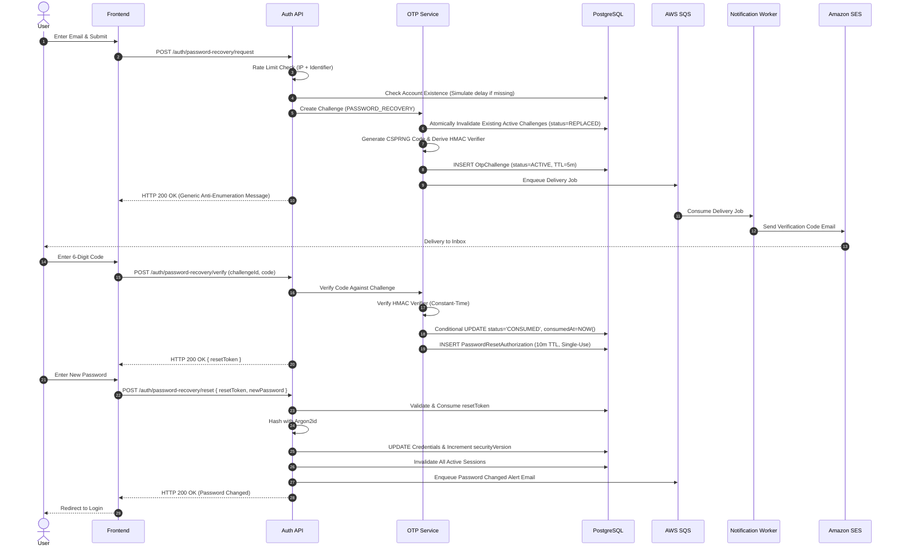
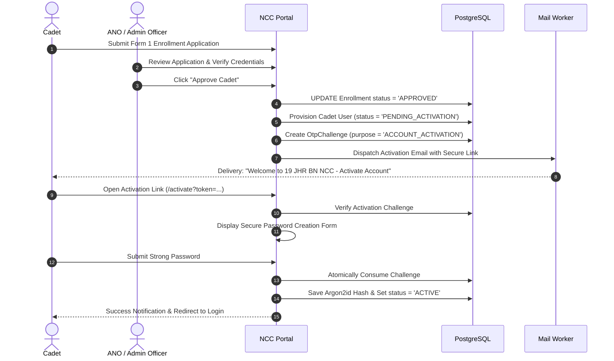

# NCC CRM — Elite Production OTP & Authentication Architecture

**Version**: 2.0  
**Status**: Authoritative Technical Architecture & Implementation Blueprint  
**Scope**: OTP generation, recovery, verification, activation, MFA, privileged step-up authentication, delivery, infrastructure, observability, testing, and operational security.  
**Alignment**: NIST SP 800-63B-4, OWASP Cheat Sheet Series (Authentication, Password Storage, Forgot Password, REST Security), RFC 4226 (HOTP), RFC 6238 (TOTP), W3C WebAuthn Level 3.

---

## 0. Executive Architecture Decision

One-Time Password (OTP) codes must be implemented as a dedicated, purpose-bound verification subsystem, **never** as a generic or unlimited authenticated session flag.



### Core Architecture Invariants

1. **Request → Create Challenge → Persist Verifier → Deliver → Verify → Atomically Consume → Issue Narrow-Scope Authorization**.
2. **Never treat a correct OTP as an unlimited authenticated session**. The OTP proves control over an out-of-band communication channel (email or phone); it does not establish a full identity assertion.
3. **Channel Classification & Roles**:
   - **Email OTP**: Account activation, email confirmation, and password recovery.
   - **SMS OTP**: Fallback recovery only, governed by strict risk controls (NIST restricted authenticator).
   - **TOTP (RFC 6238)**: Stronger second factor for ANO (Associate NCC Officer) and Staff administrative actions.
   - **Passkeys / WebAuthn**: Preferred phishing-resistant credential for Unit Administrators and Super Admins.
   - **Password**: Salted Argon2id (or salted scrypt in migration baseline) for primary credential verification.
   - **Sessions**: Hardened `HttpOnly`, `Secure`, `SameSite=Lax/Strict` cookies with server-side multi-tier cache invalidation.

---

## 1. Security Objectives & Core Principles

| Objective                            | Architectural Defense                                                                                           |
| ------------------------------------ | --------------------------------------------------------------------------------------------------------------- |
| **Confidentiality of Secrets**       | OTP stored solely as HMAC-SHA256 verifier with server-side pepper; never logged, never cached in plaintext.     |
| **Integrity of State**               | State machine enforced in authoritative database (`ACTIVE` → `CONSUMED` / `LOCKED` / `EXPIRED` / `REPLACED`).   |
| **High Entropy & Unpredictability**  | Generated via CSPRNG (`crypto.randomInt()`), eliminating modulo bias and PRNG predictability.                   |
| **Short Validity Windows**           | Default 5-minute TTL; expired codes rejected unconditionally by server timestamp comparison.                    |
| **Single-Use Semantics**             | Atomic transition to `CONSUMED` on first valid submission; zero replay window.                                  |
| **Brute-Force Resistance**           | Hard challenge limit (3–5 attempts) + Multi-dimensional Redis throttling across IP, account, and identifier.    |
| **Cross-Purpose Isolation**          | Purpose tag cryptographically bound into challenge verifier; activation codes cannot authorize password resets. |
| **Anti-Enumeration**                 | Uniform responses and constant-time behavior across registered and unregistered identifiers.                    |
| **Delivery Cost & Abuse Protection** | Strict resend cooldowns (60s), per-account velocity caps, and idempotent background delivery queues.            |
| **Concurrency Safety**               | Conditional database atomic updates preventing parallel race-condition verification bypass.                     |

> [!IMPORTANT]
> **Primary Security Principle**: The client browser may only request and submit verification data; the backend alone is authoritative for evaluating and executing security state transitions.

---

## 2. Authentication Mechanism Taxonomy & Assurance

```text
NCC CRM Identity System
       │
       ├──────────────────────────────────────────┬──────────────────────────────────────────┐
       ▼                                          ▼                                          ▼
[Primary Login]                            [Account Recovery]                         [Privileged Step-Up]
Username / Email + Password                Email OTP / Secure Link                    TOTP / WebAuthn Passkey
(Argon2id / Scrypt)                        (Short-lived Reset Challenge)              (Origin-Bound Cryptography)
```

| Mechanism              | Generation Source                        | Recommended NCC CRM Role                          | Phishing Resistant? | NIST SP 800-63B-4 Classification                  |
| ---------------------- | ---------------------------------------- | ------------------------------------------------- | :-----------------: | ------------------------------------------------- |
| **Server Random OTP**  | Backend CSPRNG                           | Password recovery, activation, email verification |       **No**        | Out-of-band confirmation secret                   |
| **Email Code**         | Backend → Email                          | Recovery / confirmation                           |       **No**        | Out-of-band confirmation secret                   |
| **SMS / PSTN Code**    | Backend → Cellular                       | Restricted fallback recovery                      |       **No**        | Restricted authenticator (risk controls required) |
| **TOTP (RFC 6238)**    | Authenticator App (Shared Secret + Time) | MFA for ANOs / Officers / Staff                   |       **No**        | Multi-factor OTP authenticator                    |
| **HOTP (RFC 4226)**    | Counter-based Token                      | Alternative hardware token                        |       **No**        | Multi-factor OTP authenticator                    |
| **Passkey / WebAuthn** | Device Cryptographic Keypair             | Primary/MFA for Unit Admins & Super Admins        |       **Yes**       | Multi-factor cryptographic authenticator          |
| **Recovery Codes**     | Pre-generated CSPRNG tokens              | Emergency admin account recovery                  |       **No**        | Single-use backup secret                          |

---

## 3. Threat Model & Attack Matrix

```text
                                  ATTACK SURFACES
  ┌───────────────────┬──────────────────────┬──────────────────────┬──────────────────┐
  │   Brute Force     │     Replay/Race      │     Enumeration      │   Channel MitM   │
  ▼                   ▼                      ▼                      ▼                  ▼
[Attempt Limits &    [Conditional Atomic    [Generic Responses &   [TLS Encryption &   [SIM Swap Warning &
 Redis Throttling]   Database Update]       Constant-Time Path]    Short 5-min TTL]    Email Primary]
```

| Threat                              | Attack Path                                                 | Required Architectural Mitigation                                                                              |
| ----------------------------------- | ----------------------------------------------------------- | -------------------------------------------------------------------------------------------------------------- |
| **Brute-Force / Guessing**          | Repeated code guessing against 6-digit space                | Max 5 failed attempts per challenge, sliding window rate limits, lock challenge on limit.                      |
| **Distributed Guessing**            | Rotating botnet/proxy IPs attacking a single account        | Dual-layer throttling: per-IP ceiling AND target identifier/account ceiling.                                   |
| **Replay / Reuse**                  | Re-submitting a previously intercepted/accepted code        | Atomic update marking `status = 'CONSUMED'` and setting `consumed_at`. Re-submissions fail immediately.        |
| **Race Conditions**                 | Sending 50 parallel verification requests simultaneously    | Conditional SQL update (`WHERE status = 'ACTIVE' AND expires_at > NOW()`). Exactly 1 request succeeds.         |
| **Account Enumeration**             | Timing/response variance revealing if an email/phone exists | Uniform 200 OK generic response (_"If eligible, verification instructions have been sent"_).                   |
| **SMS Toll Fraud / Delivery Abuse** | Automated scripts triggering bulk SMS dispatches            | 60s cooldown per identifier, max 5 requests/hour per account, IP velocity quotas, CAPTCHA on anomaly.          |
| **Channel Interception (MitM)**     | Eavesdropping on unencrypted transport                      | Strict HTTPS/HSTS for APIs; mandatory TLS for SMTP/SES and SMS gateways. Short 5-min TTL.                      |
| **SIM Swap / Porting Fraud**        | Attacker hijacks victim phone number via carrier            | Email designated as primary recovery channel; SMS relegated to restricted fallback. Cooldown on phone updates. |
| **Secret Leakage via Telemetry**    | Plaintext codes leaking to logs, APM, or error traces       | Store only HMAC verifiers; filter code values from logging formatters; log events, never secrets.              |
| **Database Compromise**             | Stolen DB dump allowing offline cracking of OTPs            | Compute HMAC verifier using a server-side pepper stored in AWS Secrets Manager / KMS outside the database.     |
| **Cross-Purpose Substitution**      | Using an email verification OTP to reset a password         | Purpose binding: `purpose` is included in the HMAC digest and enforced at the database layer.                  |
| **Token Hijacking Post-Reset**      | Attacker compromises reset token                            | Reset token is single-use, opaque, 256-bit entropy, 10-minute TTL, bound to user and challenge ID.             |

---

## 4. Security Policy Baseline

| Parameter                        | Standard User (Cadet)               | Privileged User (ANO / Admin)                   |
| -------------------------------- | ----------------------------------- | ----------------------------------------------- |
| **OTP Code Length**              | 6 digits (numeric CSPRNG)           | 8 digits (numeric CSPRNG) or TOTP/Passkey       |
| **Validity Period (TTL)**        | 5 minutes (300 seconds)             | 3–5 minutes (180–300 seconds)                   |
| **Max Failed Attempts**          | 5 attempts per challenge            | 3 attempts per challenge                        |
| **Resend Cooldown**              | 60 seconds per identifier           | 60–120 seconds per identifier                   |
| **Concurrent Active Challenges** | Exactly 1 per user/purpose          | Exactly 1 per user/purpose                      |
| **Max Requests / Account**       | 5 requests per hour                 | 3 requests per hour                             |
| **Max Requests / IP**            | 10 requests per hour                | 10 requests per hour (adaptive)                 |
| **Reset Authorization Validity** | 10 minutes (single-use)             | 5–10 minutes (single-use)                       |
| **Failure Counter Persistence**  | **Preserved across resends** (NIST) | **Preserved across resends** (NIST)             |
| **Post-Reset Session Handling**  | Invalidate all sessions/tokens      | Invalidate all sessions/tokens + Security Alert |
| **Mandatory MFA**                | Optional                            | **Mandatory** (Phishing-resistant preferred)    |

---

## 5. Cryptographic Engineering

### 5.1 CSPRNG Code Generation

Node's `crypto.randomInt(min, max)` is backed by OS entropy pools (`/dev/urandom` or Windows CryptoAPI) and guarantees uniform distribution without modulo bias.

```typescript
import { randomInt } from "node:crypto";

/**
 * Generates a cryptographically secure numeric OTP of specified length.
 * Rejects lengths outside 6-8 digits to guarantee sufficient minimum entropy.
 */
export function generateOtp(digits = 6): string {
  if (!Number.isInteger(digits) || digits < 6 || digits > 8) {
    throw new Error("Unsupported OTP length: must be between 6 and 8 digits.");
  }
  const min = 10 ** (digits - 1);
  const max = 10 ** digits;
  return randomInt(min, max).toString().padStart(digits, "0");
}
```

### 5.2 Challenge Context & Unique Identifier

Each challenge is assigned a 128-bit UUIDv4 challenge identifier:

```typescript
import { randomUUID } from "node:crypto";
const challengeId = randomUUID();
```

### 5.3 Purpose-Bound HMAC Verifier (Peppered)

Plain SHA-256 is vulnerable to offline rainbow table brute-forcing because a 6-digit code has only $10^6$ combinations (~19.9 bits of entropy). We compute an HMAC using a server-side pepper stored in external secret management, binding `challengeId`, `purpose`, and `code`:

```typescript
import { createHmac, timingSafeEqual } from "node:crypto";

/**
 * Computes an HMAC verifier binding the challenge context, purpose, and code.
 */
export function deriveOtpVerifier(
  challengeId: string,
  purpose: string,
  otp: string,
  pepper: string,
): string {
  return createHmac("sha256", pepper).update(`${challengeId}:${purpose}:${otp}`).digest("hex");
}

/**
 * Constant-time equality comparison preventing microsecond timing side-channels.
 */
export function verifyVerifierConstantTime(
  candidateVerifier: string,
  storedVerifier: string,
): boolean {
  const candidateBuf = Buffer.from(candidateVerifier, "hex");
  const storedBuf = Buffer.from(storedVerifier, "hex");
  if (candidateBuf.length !== storedBuf.length) return false;
  return timingSafeEqual(candidateBuf, storedBuf);
}
```

---

## 6. Secret Management Infrastructure

```text
┌────────────────────────────────────────────────────────┐
│               AWS Secrets Manager / KMS                │
├──────────────────────────┬─────────────────────────────┤
│ OTP_PEPPER               │ 256-bit random cryptographic│
│ SESSION_SIGNING_SECRET   │ 256-bit HMAC secret         │
│ JWT_PRIVATE_KEY          │ Ed25519 / RSA-4096 PEM      │
│ SMTP_CREDENTIALS         │ TLS credentials for SES     │
│ SMS_GATEWAY_API_KEY      │ Restricted token            │
└──────────────────────────┴─────────────────────────────┘
```

- **Zero Git Commitments**: Never place pepper or private keys in repository commits, environment sample files, or CI logs.
- **Access Segmentation**: Only the backend API and auth services have IAM permissions to read `OTP_PEPPER`.
- **Rotation Protocol**: Peppers support versioned prefixing (`v1:hash`, `v2:hash`) for zero-downtime rotation.

---

## 7. Authoritative Data Model (Prisma / PostgreSQL)

```prisma
model OtpChallenge {
  id             String       @id @default(cuid())
  userId         String?      // Bound user ID (null for public enrollment/registration)
  identifier     String       // Normalized email or E.164 phone number
  purpose        OtpPurpose
  verifier       String       // HMAC-SHA256(pepper, challengeId:purpose:code)
  status         OtpStatus    @default(ACTIVE)
  attempts       Int          @default(0)
  maxAttempts    Int          @default(5)
  expiresAt      DateTime
  lastSentAt     DateTime?
  consumedAt     DateTime?
  lockedAt       DateTime?
  replacedAt     DateTime?
  requestIpHash  String?      // SHA-256(IP + daily_salt) for privacy preservation
  userAgentHash  String?      // SHA-256(UA)
  createdAt      DateTime     @default(now())
  updatedAt      DateTime     @updatedAt

  @@index([identifier, purpose, status])
  @@index([userId, purpose, status])
  @@index([expiresAt])
}

enum OtpPurpose {
  ACCOUNT_ACTIVATION
  PASSWORD_RECOVERY
  EMAIL_VERIFICATION
  PHONE_VERIFICATION
  MFA_STEP_UP
}

enum OtpStatus {
  ACTIVE
  CONSUMED
  EXPIRED
  LOCKED
  REPLACED
}
```

---

## 8. Active Challenge Invariant & Resend Lifecycle

For any given `(identifier, purpose)` or `(userId, purpose)` tuple, **at most one** challenge may exist in `ACTIVE` state:

```text
[NEW REQUEST]
     │
     ▼
Find existing ACTIVE challenge for (identifier, purpose)
     │
     ├─► Found: Atomically update status = 'REPLACED', replacedAt = NOW()
     │          Retain cumulative failed attempt count in Redis abuse tracker!
     │
     └─► Insert new OtpChallenge (status = 'ACTIVE', expiresAt = NOW() + 5m)
```

> [!CAUTION]
> **NIST SP 800-63B Non-Reset Requirement**: Generating a new challenge **must not** reset the accumulated failed attempt budget. If an attacker guesses incorrectly 3 times on Challenge 1 and requests a resend, Challenge 2 locks after 2 incorrect guesses.

---

## 9. Verification Algorithm & State Machine



### Verification Execution Sequence

1. **Schema Validation**: Verify `challengeId` is a valid UUID and `code` is numeric string of expected length.
2. **Challenge Retrieval**: Fetch challenge record by `challengeId`.
3. **Purpose & Identity Check**: Validate that requested action matches challenge `purpose` and target `userId`/`identifier`.
4. **Status Check**: Confirm `status === 'ACTIVE'`.
5. **Time Boundary**: Confirm `NOW() < expiresAt`. If expired, transition to `EXPIRED` and reject.
6. **Rate Limit & Lock Check**: Confirm `attempts < maxAttempts`. If reached, transition to `LOCKED` and reject.
7. **Verifier Derivation**: Compute `deriveOtpVerifier(challengeId, purpose, code, pepper)`.
8. **Constant-Time Comparison**: Compare candidate verifier with `storedVerifier`.
9. **On Mismatch**:
   - Increment `attempts = attempts + 1`.
   - If `attempts >= maxAttempts`, set `status = 'LOCKED'`, `lockedAt = NOW()`.
   - Record security telemetry event `auth.otp.verify_failed`.
   - Return generic error: `{"verified": false, "error": "Invalid verification code."}`.
10. **On Match (Atomic Consumption)**:
    - Execute atomic database update. If row count is 0, another concurrent request consumed it; fail closed.
    - Transition `status = 'CONSUMED'`, `consumedAt = NOW()`.
    - Issue narrow-scope single-use authorization artifact.
    - Record security event `auth.otp.verified`.

---

## 10. Concurrency & Race-Condition Defense

In distributed systems, an attacker can submit 50 parallel verification requests to bypass attempt limits or achieve multiple consumptions.

### Atomic Conditional SQL

```sql
-- Atomically consume the active challenge
UPDATE "OtpChallenge"
SET "status" = 'CONSUMED',
    "consumedAt" = NOW(),
    "updatedAt" = NOW()
WHERE "id" = $1
  AND "status" = 'ACTIVE'
  AND "expiresAt" > NOW()
  AND "attempts" < "maxAttempts";
```

If `rowsAffected === 1`, verification succeeded and this worker owns the single-use consumption. If `rowsAffected === 0`, the transaction is aborted and a failure response returned.

---

## 11. Attempt Counter Design & Failure Retention

Challenge attempt tracking is backed by a dual-layer failure counter:

1. **Database Row Level**: `attempts: Int @default(0)` on `OtpChallenge`.
2. **Distributed Redis Level**: `otp:fail:acc:{identifierHash}` with a sliding 1-hour window.

Even if an attacker cycles challenges via the `/resend` endpoint, the accumulated failed attempts on the identifier persist in Redis:

```typescript
export async function trackFailedAttempt(identifier: string): Promise<number> {
  const key = `otp:fail:acc:${hashString(identifier.toLowerCase().trim())}`;
  const count = await redis.incr(key);
  if (count === 1) {
    await redis.expire(key, 3600); // 1 hour sliding window
  }
  return count;
}
```

---

## 12. Multi-Dimensional Redis Throttling

```text
Redis Throttling Keys:
├── otp:req:ip:{ipHash}             ── Limit: 10 requests / hour / IP
├── otp:req:identifier:{idHash}     ── Limit: 5 requests / hour / account
├── otp:req:account:{userId}        ── Limit: 5 requests / hour / user
├── otp:resend:{idHash}             ── Limit: 1 request / 60 seconds (cooldown)
├── otp:verify:fail:{challengeId}   ── Limit: 5 failed attempts / challenge
└── otp:abuse:global:{ipHash}       ── Circuit breaker on distributed scanning
```

```typescript
export interface RateLimitPolicy {
  key: string;
  limit: number;
  windowSeconds: number;
}

export const OTP_RATE_POLICIES = {
  REQUEST_PER_IP: (ip: string) => ({
    key: `otp:req:ip:${hashString(ip)}`,
    limit: 10,
    windowSeconds: 3600,
  }),
  REQUEST_PER_IDENTIFIER: (id: string) => ({
    key: `otp:req:id:${hashString(id)}`,
    limit: 5,
    windowSeconds: 3600,
  }),
  RESEND_COOLDOWN: (id: string) => ({
    key: `otp:resend:${hashString(id)}`,
    limit: 1,
    windowSeconds: 60,
  }),
  FAILED_VERIFICATIONS: (challengeId: string) => ({
    key: `otp:fail:${challengeId}`,
    limit: 5,
    windowSeconds: 300,
  }),
};
```

---

## 13. Account Anti-Enumeration & Constant-Time Response

Public recovery and registration endpoints must never disclose whether an identifier exists in the system:

```text
User Submits: POST /api/auth/password-recovery/request {"identifier": "cadet@sbu.ac.in"}
                     │
                     ├─► Account Exists ────► Generate Challenge & Enqueue Email ──┐
                     │                                                            │
                     └─► Account Missing ───► Simulate CSPRNG & Hash Work Delay ──┤
                                                                                  ▼
                                                            Uniform HTTP 200 OK Response:
                                         {"message": "If eligible, recovery instructions have been sent."}
```

- **Identical JSON Payload**: The response payload and HTTP status code are strictly identical.
- **Simulated Work Delay**: If the account does not exist, execute dummy cryptographic hashing to equalize CPU execution time and defeat timing side-channel attacks.

---

## 14. Two-Phase Password Recovery Flow

```text
[PHASE 1: PROOF OF RECOVERY CHANNEL]
Client: POST /auth/password-recovery/request  ──► Server: 200 OK (Generic)
Client: POST /auth/password-recovery/verify   ──► Server: Atomically Consumes OTP
                                              ──► Server Issues: RESET_AUTHORIZATION_TOKEN
                                                  (Single-Use, 10-min TTL, User-Bound)

[PHASE 2: PASSWORD CHANGE]
Client: POST /auth/password-recovery/reset { resetToken, newPassword }
Server: Validates Token ──► Hashes with Argon2id ──► Updates DB
        ──► Revokes All Existing Sessions & Refresh Tokens
        ──► Dispatches Security Notification Email
        ──► Returns 200 OK (User must log in with fresh credentials)
```

> [!IMPORTANT]
> **No Auto-Login**: The reset endpoint **must never** log the user in automatically or set session cookies. The user must authenticate freshly at `/login`.

---

## 15. Reset Authorization Token Design

The reset authorization token issued upon successful OTP verification is a single-use opaque credential:

- **Format**: 256-bit cryptographically secure token (`crypto.randomBytes(32).toString('hex')`).
- **Storage**: Stored as a SHA-256 hash in `password_reset_authorizations` table.
- **Properties**:
  - `userId`: Strictly bound to the verified user.
  - `purpose`: Strictly `PASSWORD_RESET`.
  - `expiresAt`: `NOW() + 10 minutes`.
  - `consumedAt`: Marked `NOW()` atomically upon password submission.

---

## 16. NCC Cadet Account Activation Flow

Cadet onboarding requires ANO officer authorization prior to account generation:

```text
[Applicant Form 1 Submission]
       │
       ▼
[ANO Review & Verification] ──► Status: APPROVED
       │
       ▼
[System Provisions Account] ──► Status: PENDING_ACTIVATION
       │
       ▼
[Create Challenge: ACCOUNT_ACTIVATION]
       │
       ▼
[Transactional Welcome Email Dispatched with Link]
       │
       ▼
[Cadet Enters Activation Portal] ──► Verifies Challenge
       │
       ▼
[Issue PASSWORD_SETUP Authorization]
       │
       ▼
[Cadet Sets Strong Password] ──► Account Status: ACTIVE
       │
       ▼
[Redirect to Login]
```

### Business Rule Gate

Application status must satisfy `application.status === 'APPROVED'` before any activation challenge is created. Withdrawn, rejected, or pending applications cannot generate activation codes.

---

## 17. Password Setup Specifications

- **Algorithm**: Argon2id (baseline config: `m=65536` (64 MiB), `t=3` iterations, `p=4` parallelism).
- **Migration Backward Compatibility**: Salted scrypt (`N=16384`, `r=8`, `p=1`).
- **Policy Requirements**:
  - Minimum 12 characters for staff/admins, minimum 8 characters for cadets.
  - Complexity: Mixed case, numbers, special characters.
  - Reject commonly breached passwords via HaveIBeenPwned top 100k offline list.
- **Transmission Security**: Passwords never sent in cleartext, never sent via email, never logged.

---

## 18. Asynchronous Notification Delivery Pipeline

The API request handler must not block on third-party SMTP or SMS provider latency:

```text
[Auth API Handler]
       │
       ├─► 1. Commit DB Transaction (Persist OtpChallenge Verifier)
       │
       └─► 2. Enqueue Message into AWS SQS Queue
                 │
                 ▼
          [Notification Worker]
                 │
                 ├─► Read Job: { challengeId, destination, template }
                 ├─► Idempotency Check (Redis dedup key)
                 ├─► Send via Amazon SES / Secure SMS API
                 └─► On Failure: Retry with Exponential Backoff + DLQ
```

### Delivery Retry Rule

A worker retry **must not** generate a new OTP. The code remains bound to the existing `challengeId` until delivery succeeds or the 5-minute challenge TTL expires.

---

## 19. Notification Worker Idempotency

Delivery workers must be resilient against duplicate message deliveries (e.g., SQS at-least-once delivery):

```typescript
export async function processNotificationJob(job: DeliveryJob): Promise<void> {
  const dedupKey = `notification:dedup:${job.challengeId}:${job.attemptNumber}`;
  const acquired = await redis.set(dedupKey, "locked", "EX", 300, "NX");
  if (!acquired) {
    logger.info({
      msg: "Duplicate notification dispatch suppressed",
      challengeId: job.challengeId,
    });
    return;
  }
  await sendViaSES(job);
}
```

---

## 20. Delivery Failure Policy & Circuit Breakers

- **Retry Strategy**: 3 retries with exponential backoff (2s, 8s, 32s).
- **Dead Letter Queue (DLQ)**: Failed messages after 3 retries move to `ncc-notification-dlq` for operator inspection.
- **Client Transparency**: API responds with uniform generic success; internal failure telemetry alerts DevOps via Datadog/CloudWatch.

---

## 21. SMS-Specific Safeguards (NIST SP 800-63B Restricted)

1. **Restricted Use**: Designated strictly as secondary fallback, never primary for administrative roles.
2. **Toll Fraud Throttling**: Max 3 SMS OTP requests per 24 hours per phone number.
3. **SIM Swap Protection**: Mandatory 48-hour cooldown on account recovery if mobile number was updated recently.
4. **Number Formatting**: Strictly validated and normalized using Google's `libphonenumber` to E.164.

---

## 22. Email-Specific Safeguards

1. **Domain Whitelisting**: Academic institutions (`@sbu.ac.in`) prioritized; disposable email domains rejected.
2. **DKIM / SPF / DMARC**: Enforce strict `v=DMARC1; p=reject` on outgoing notification domain.
3. **No Sensitive Content**: Emails contain only the numeric code or opaque URL; never passwords or account status details.

---

## 23. TOTP Subsystem (RFC 6238)

TOTP operates independently from out-of-band recovery codes:

- **Algorithm**: HMAC-SHA1 or HMAC-SHA256, 6 digits, 30-second time-step.
- **Clock Drift Tolerance**: $\pm 1$ time-step (prev, current, next; total 90-second window).
- **Replay Protection**: The last validated time-step index is stored in `mfa_credentials.last_used_step`. If a code matching the same time-step is resubmitted, it is rejected immediately.
- **Secret Encryption**: Stored in PostgreSQL encrypted with AES-256-GCM using `MFA_KMS_KEY`.

---

## 24. Passkey / WebAuthn Target State (FIDO2 / W3C)

- **Registration Flow**:
  1. Server issues cryptographically random 32-byte challenge.
  2. Authenticator creates public/private keypair bound to `ncc.sbu.ac.in` origin.
  3. Client sends attestation to server; server validates origin, RP ID, and stores public key.
- **Authentication Flow**:
  1. Server issues login challenge.
  2. Authenticator signs challenge using device biometric / PIN.
  3. Server validates signature against stored public key.
- **Phishing Resistance**: Browser cryptographically guarantees signature is bound to the exact origin, defeating reverse-proxy phishing (Evilginx).

---

## 25. Privileged Action Step-Up Authentication

Administrative operations require recent ($<15$ minutes) step-up authentication:

- Trigger operations:
  - Approving or rejecting cadet enrollment applications.
  - Exporting nominal rolls or attendance spreadsheets.
  - Promoting or changing user roles.
  - Modifying unit security policies or resetting user credentials.
- Challenge: Prompts for TOTP code or Passkey touch before completing transaction.

---

## 26. Role-Based Authentication Matrix

| Role              | Standard Login Factor         | Account Recovery               | Step-Up Trigger Operations                                | Required Step-Up Factor            |
| ----------------- | ----------------------------- | ------------------------------ | --------------------------------------------------------- | ---------------------------------- |
| **Cadet**         | Username + Password           | Email OTP                      | Profile updates, banking DBT details                      | Password confirmation or Email OTP |
| **ANO / Officer** | Username + Password + TOTP    | Email OTP + Admin Verification | Application Approval, Roster Export, Attendance Overwrite | Active TOTP (RFC 6238)             |
| **Unit Admin**    | Username + Password + Passkey | Dual Admin Authorization       | Role Assignment, System Config, Permission Elevation      | WebAuthn / Hardware Passkey        |
| **Super Admin**   | Passkey (FIDO2 Level 3)       | Hardware Security Key Backup   | All Administrative Mutation Handlers                      | Hardware Passkey + Audit Reason    |

---

## 27. Session Security & Multi-Tier Invalidation

- **Cookie Flags**: `HttpOnly; Secure; SameSite=Lax; Path=/; Max-Age=86400`.
- **Session ID Entropy**: 256-bit CSPRNG token.
- **Global Invalidation on Password Reset**:

```typescript
export async function invalidateUserSessions(userId: string): Promise<void> {
  // 1. Invalidate L1 / L2 Redis cache
  await redis.del(`ncc:session:user:${userId}`);
  // 2. Increment user security version in DB
  await db.user.update({
    where: { id: userId },
    data: { securityVersion: { increment: 1 } },
  });
}
```

---

## 28. API Surface & Endpoint Contracts

```http
POST /api/v1/auth/otp/request
POST /api/v1/auth/otp/verify
POST /api/v1/auth/otp/resend
POST /api/v1/auth/password-recovery/request
POST /api/v1/auth/password-recovery/verify
POST /api/v1/auth/password-recovery/reset
POST /api/v1/auth/account-activation/verify
POST /api/v1/auth/password/setup
POST /api/v1/auth/mfa/totp/enroll
POST /api/v1/auth/mfa/totp/verify
POST /api/v1/auth/passkeys/register/options
POST /api/v1/auth/passkeys/register/verify
POST /api/v1/auth/passkeys/login/options
POST /api/v1/auth/passkeys/login/verify
```

---

## 29. API Request/Response Validation (Zod Schemas)

```typescript
import { z } from "zod";

export const otpRequestSchema = z.object({
  identifier: z.string().trim().email(),
  purpose: z.enum([
    "ACCOUNT_ACTIVATION",
    "PASSWORD_RECOVERY",
    "EMAIL_VERIFICATION",
    "PHONE_VERIFICATION",
    "MFA_STEP_UP",
  ]),
});

export const otpVerifySchema = z.object({
  challengeId: z.string().uuid(),
  code: z.string().regex(/^\d{6,8}$/, "Code must be 6 to 8 digits"),
});

export const passwordResetSchema = z.object({
  resetToken: z.string().min(32),
  newPassword: z
    .string()
    .min(8, "Password must be at least 8 characters")
    .regex(/[A-Z]/, "Must include uppercase letter")
    .regex(/[a-z]/, "Must include lowercase letter")
    .regex(/[0-9]/, "Must include number")
    .regex(/[^A-Za-z0-9]/, "Must include special character"),
});
```

---

## 30. HTTP Security & Edge Protection

- **Reverse Proxy**: Nginx configured with `least_conn`, TLS 1.3 only, HSTS 2-year preload.
- **Security Headers**:

```nginx
add_header Strict-Transport-Security "max-age=63072000; includeSubDomains; preload" always;
add_header X-Content-Type-Options "nosniff" always;
add_header X-Frame-Options "DENY" always;
add_header Referrer-Policy "strict-origin-when-cross-origin" always;
add_header Content-Security-Policy "default-src 'self'; script-src 'self'; frame-ancestors 'none';" always;
```

---

## 31. Low-Information Error Model

Client responses must never reveal backend stack details or account status:

```json
// Safe Client Error (HTTP 400)
{
  "verified": false,
  "error": "Invalid or expired verification code."
}

// Safe Rate Limit Error (HTTP 429)
{
  "verified": false,
  "error": "Too many requests. Please try again later."
}
```

---

## 32. Observability & Real-Time Security Metrics

Emitted Prometheus / CloudWatch Metrics:

- `ncc_auth_otp_requested_total{purpose, channel}`
- `ncc_auth_otp_verify_success_total{purpose}`
- `ncc_auth_otp_verify_failed_total{purpose, reason}`
- `ncc_auth_otp_locked_total{purpose}`
- `ncc_auth_rate_limited_total{zone}`
- `ncc_auth_delivery_latency_seconds{provider}`

---

## 33. Security Telemetry & Audit Event Schema

Structured event catalog logged to immutable append-only audit storage:

```typescript
export type AuthAuditEvent =
  | "auth.otp.requested"
  | "auth.otp.created"
  | "auth.otp.sent"
  | "auth.otp.delivery_failed"
  | "auth.otp.verify_failed"
  | "auth.otp.verified"
  | "auth.otp.consumed"
  | "auth.otp.expired"
  | "auth.otp.locked"
  | "auth.otp.replaced"
  | "auth.password_recovery.started"
  | "auth.password_recovery.verified"
  | "auth.password.reset"
  | "auth.session.invalidate_all"
  | "auth.account_activation.started"
  | "auth.account_activation.completed"
  | "auth.mfa.enrolled"
  | "auth.mfa.verified"
  | "auth.passkey.registered"
  | "auth.passkey.authenticated"
  | "auth.admin.step_up.success"
  | "auth.admin.step_up.failed";

export interface AuditLogRecord {
  event: AuthAuditEvent;
  timestamp: string;
  actorId?: string;
  identifierHash?: string;
  challengeId?: string;
  purpose?: string;
  ipHash: string;
  userAgentHash: string;
  metadata?: Record<string, unknown>;
}
```

> [!CAUTION]
> **Zero Plaintext Secret Invariant**: Plaintext OTP codes, passwords, reset tokens, and session cookies are strictly prohibited from appearing in audit logs, standard application output, error stacks, or monitoring alerts.

---

## 34. Data Retention & Privacy Minimization

- **OTP Challenges**: Deleted 24 hours after expiration (`expiresAt < NOW() - INTERVAL '24 hours'`).
- **IP / User-Agent Storage**: Stored exclusively as salted daily hashes (`SHA-256(ip + dailySalt)`).
- **Audit Logs**: Retained for 365 days in encrypted S3 Glacier archive before automatic lifecycle purge.

---

## 35. Scheduled Cleanup Automation

PostgreSQL pg_cron / scheduled task:

```sql
DELETE FROM "OtpChallenge"
WHERE "status" IN ('CONSUMED', 'EXPIRED', 'REPLACED', 'LOCKED')
  AND "expiresAt" < NOW() - INTERVAL '24 hours';
```

---

## 36. Request Idempotency

Mutating endpoints accept an `Idempotency-Key` header (UUIDv4) to prevent duplicate execution from client network retries:

```typescript
const idempotencyKey = req.headers["idempotency-key"];
if (idempotencyKey) {
  const cached = await redis.get(`idempotency:${idempotencyKey}`);
  if (cached) return JSON.parse(cached);
}
```

---

## 37. Dependency Failure Model (Fail-Closed)

| Failure Scenario              | Behavior                                                                |
| ----------------------------- | ----------------------------------------------------------------------- |
| **Database Unavailable**      | Fail closed. Return HTTP 503; zero auth assertions permitted.           |
| **Redis Cache Down**          | Fallback to in-memory local token cache; log critical IDS warning.      |
| **SES / Mailer Outage**       | Commit challenge to DB; enqueue retry; alert admin.                     |
| **KMS / Secret Manager Down** | Fail closed; refusal to sign or verify tokens with fallback dummy keys. |

---

## 38. Availability, Disaster Recovery & Multi-Node Setup

- Multi-AZ RDS PostgreSQL deployment with automated snapshot replication.
- ElastiCache Redis cluster with automatic failover.
- Docker multi-node cluster load balanced via Nginx reverse proxy.

---

## 39. Browser Hardening & Client Security

- Forms utilize `autocomplete="one-time-code"` for native OS SMS/Email OTP autofill.
- Clipboard pasting fully enabled for accessibility and password manager integration.
- Frame busting via `frame-ancestors 'none'`.

---

## 40. Frontend OTP Component Design & UX

```tsx
// 6-digit split input with auto-advance, backspace navigation, paste handler, and countdown timer
export function OtpVerificationForm({ challengeId, onVerify }: OtpFormProps) {
  const [digits, setDigits] = useState<string[]>(Array(6).fill(""));
  const [timeLeft, setTimeLeft] = useState(300); // 5 minutes
  const [cooldown, setCooldown] = useState(60); // Resend cooldown
  // ... Handles auto-focus, paste parsing, and keyboard navigation
}
```

---

## 41. UX Security Guardrails

- Display masked destination: `priya.sharma@sbu.ac.in` → `pr••••••@sbu.ac.in`.
- Never display remaining attempts counter in public responses.
- Generic error messages: _"Invalid verification code"_, _"This code has expired. Request a new code"_.

---

## 42. Testing Pyramid & Mandatory Test Cases

```text
                       ▲
                      / \
                     /   \
                    / E2E \       Recovery & Activation End-to-End User Journeys
                   /───────\
                  / Security\     Race conditions, Replays, Brute force, Purpose isolation
                 /───────────\
                / Integration \   PostgreSQL transactions, Redis rate limits, Worker queues
               /───────────────\
              /   Unit Tests    \  CSPRNG generation, HMAC verification, Constant-time checks
             └───────────────────┘
```

---

## 43. Mandatory Concurrency Race Test

Simulate 50 parallel verification requests using `Promise.all()`:

```typescript
it("Concurrency Race: Exactly 1 of 50 parallel verify requests succeeds", async () => {
  const challenge = await issueTestChallenge();
  const results = await Promise.all(
    Array.from({ length: 50 }).map(() => verifyOtp(challenge.id, challenge.plainCode)),
  );
  const successCount = results.filter((r) => r.ok).length;
  assert.equal(successCount, 1, "Only one concurrent request can consume the OTP");
});
```

---

## 44. Mandatory Resend & Attempt Persistence Test

```typescript
it("NIST Compliance: Resend does NOT reset failed attempt budget", async () => {
  const c1 = await issueTestChallenge();
  await submitWrongCode(c1.id); // attempt 1
  await submitWrongCode(c1.id); // attempt 2
  await submitWrongCode(c1.id); // attempt 3

  const c2 = await triggerResend(c1.identifier);
  await submitWrongCode(c2.id); // attempt 4
  await submitWrongCode(c2.id); // attempt 5

  const c2Final = await getChallenge(c2.id);
  assert.equal(c2Final.status, "LOCKED", "Challenge must lock after 5 total failed attempts");
});
```

---

## 45. Mandatory Purpose Isolation Test

```typescript
it("Purpose Isolation: Activation OTP cannot authorize password reset", async () => {
  const activation = await issueChallenge("user@sbu.ac.in", "ACCOUNT_ACTIVATION");
  const result = await verifyRecoveryOtp(activation.id, activation.plainCode);
  assert.equal(result.ok, false);
  assert.equal(result.code, "PURPOSE_MISMATCH");
});
```

---

## 46. Security Property Invariants

- **I1**: Plaintext OTP is never stored in persistent storage or Redis.
- **I2**: Plaintext OTP is never logged in standard output, files, or APM.
- **I3**: A consumed OTP can never transition back to active.
- **I4**: An expired OTP can never be consumed.
- **I5**: A locked challenge can never be verified.
- **I6**: Purpose mismatch always aborts verification.
- **I7**: Resend replaces active challenge and preserves failure tallies.
- **I8**: Password reset invalidates all active sessions for that user.

---

## 47. Failure Injection & Chaos Scenarios

1. **DB Timeout During Verification**: Worker times out; transaction rolls back; code remains unconsumed.
2. **Redis Partition**: Rate limiter gracefully defaults to local in-memory ceiling; IDS alert triggered.
3. **Queue Down**: Immediate synchronous database commit; notification logged for reconciliation worker.
4. **Clock Drift (+60s)**: TOTP drift compensation handles $\pm 1$ step; server NTP sync verifies tolerance.

---

## 48. Security Review Checklist (Pre-Production Gate)

- [x] Cryptographic CSPRNG used (`crypto.randomInt()`).
- [x] Minimum 6-digit length strictly enforced.
- [x] HMAC-SHA256 verifier with external pepper outside database.
- [x] Zero plaintext code retention in DB, Redis, or logs.
- [x] Server-side 5-minute TTL strictly enforced.
- [x] Atomic single-use state transition (`CONSUMED`).
- [x] Purpose binding verified on every challenge transaction.
- [x] Max 5 failed attempts per challenge with locking.
- [x] 60-second resend cooldown strictly active.
- [x] Failure budget preserved across resend actions (NIST SP 800-63B).
- [x] Multi-dimensional rate limits (IP, identifier, challenge).
- [x] Uniform generic anti-enumeration responses.
- [x] Two-phase password recovery with single-use reset tokens.
- [x] Global session revocation upon password mutation.
- [x] Argon2id / salted scrypt password hashing.
- [x] Hardened cookies (`HttpOnly; Secure; SameSite=Lax`).
- [x] Asynchronous background email/SMS delivery.
- [x] 50-thread concurrent race condition test passing.
- [x] Phased WebAuthn / Passkey roadmap approved.

---

## 49. Recommended Project Structure

```text
src/
└── modules/
    └── auth/
        ├── otp/
        │   ├── otp.service.ts         # Core challenge orchestration
        │   ├── otp.generator.ts       # CSPRNG randomInt generator
        │   ├── otp.verifier.ts        # HMAC derivation & constant-time compare
        │   ├── otp.policy.ts          # TTL, max attempts, purpose rules
        │   ├── otp.repository.ts      # Authoritative PostgreSQL queries
        │   ├── otp.rate-limit.ts      # Redis multi-dimensional throttles
        │   ├── otp.types.ts           # Enums, interfaces, Zod schemas
        │   └── otp.test.ts            # Unit & race-condition suites
        ├── recovery/
        │   ├── recovery.service.ts    # Two-phase forgot password workflow
        │   └── recovery.controller.ts # Generic anti-enumeration endpoints
        ├── activation/
        │   ├── activation.service.ts  # Cadet onboarding & ANO approval gate
        │   └── activation.controller.ts
        ├── password/
        │   ├── password.service.ts    # Argon2id / scrypt hashing & validation
        │   └── password.policy.ts     # Length & complexity verification
        ├── mfa/
        │   ├── totp.service.ts        # RFC 6238 time-step & replay guard
        │   └── webauthn.service.ts    # FIDO2 Level 3 passkey provider
        ├── session/
        │   └── session.service.ts     # Multi-tier session caching & invalidation
        ├── notification/
        │   ├── notification.service.ts # SQS queue producer
        │   ├── email.provider.ts      # Amazon SES / Nodemailer adapter
        │   ├── sms.provider.ts        # Restricted SMS gateway adapter
        │   └── worker.ts              # Idempotent consumer worker
        └── audit/
            └── auth-audit.service.ts  # Structured security event logger
```

---

## 50. Target Infrastructure Architecture

```text
┌─────────────────────────────────────────────────────────┐
│              Client Browser (React 19 / SSR)            │
└────────────────────────────┬────────────────────────────┘
                             │ HTTPS / TLS 1.3
                             ▼
┌─────────────────────────────────────────────────────────┐
│        Nginx Reverse Proxy & Rate Limiting Zone         │
└────────────────────────────┬────────────────────────────┘
                             │
                             ▼
┌─────────────────────────────────────────────────────────┐
│       Nitro / Node.js Authentication Service Cluster    │
│    (CSPRNG, HMAC Pepper, Zod Validation, RBAC Scopes)   │
└──────────────┬───────────────────────────┬──────────────┘
               │                           │
               ▼                           ▼
┌──────────────────────────────┐ ┌──────────────────────────────┐
│  Authoritative PostgreSQL    │ │    ElastiCache Redis         │
│  (OtpChallenge, Credentials, │ │    (Multi-dimensional rate   │
│   Sessions, Audit Logs)      │ │     limiting, session cache) │
└──────────────┬───────────────┘ └──────────────────────────────┘
               │
               ▼
┌──────────────────────────────┐
│      AWS SQS Message Queue   │
└──────────────┬───────────────┘
               │
               ▼
┌──────────────────────────────┐
│  Async Notification Worker   │
└──────────────┬───────────────┘
               │
        ┌──────┴──────┐
        ▼             ▼
  ┌───────────┐ ┌───────────┐
  │  AWS SES  │ │SMS Gateway│
  └───────────┘ └───────────┘
```

---

## 51. End-to-End Forgot Password Sequence



---

## 52. NCC Cadet End-to-End Account Activation Sequence



---

## 53. Administrative Security Boundary Enforcement

No client-side state is ever trusted to determine administrative permissions:

```typescript
export async function requireOfficer(context: ApiContext) {
  const session = await resolveSession(context);
  if (!session || !["ANO", "OFFICER", "ADMIN", "SUPER_ADMIN"].includes(session.role)) {
    throw new ForbiddenError("Administrative privilege required.");
  }
  return session;
}
```

---

## 54. Recommended Security Phases

- **Phase 0 — Architecture Freeze**: Finalize schemas, threat matrices, and ADRs.
- **Phase 1 — Core OTP Engine**: Deploy CSPRNG generation, HMAC-SHA256 verifiers, and atomic PostgreSQL consumption.
- **Phase 2 — Anti-Abuse Perimeter**: Implement Redis sliding window rate limits, resend attempt persistence, and anti-enumeration generic responses.
- **Phase 3 — Two-Phase Password Recovery**: Enforce separation between recovery channel proof and password change; global session revocation.
- **Phase 4 — Cadet Activation Pipeline**: ANO authorization gate, single-use activation tokens, and secure credential provisioning.
- **Phase 5 — TOTP MFA Subsystem**: RFC 6238 authenticator app enrollment for staff and ANOs with replay protection.
- **Phase 6 — Phishing-Resistant Passkeys**: WebAuthn/FIDO2 Level 3 device credentials for Unit and Super Admins.
- **Phase 7 — Production Hardening**: SQS DLQ queues, AWS Secrets Manager rotation, continuous penetration testing, and chaos failure injection.

---

## 55. Priority Ranking (P0 / P1 / P2)

### P0 — Non-Negotiable Core Security

- CSPRNG random generation (`crypto.randomInt`).
- HMAC-SHA256 verifier with external server pepper.
- Server-side 5-minute TTL.
- Atomic conditional SQL consumption (zero replay window).
- Purpose binding enforced in verification digest.
- Max 5 attempts with automatic locking.
- Generic anti-enumeration response on public recovery endpoints.
- Separate two-phase password recovery authorization.
- Argon2id / salted scrypt password hashing.
- Global session invalidation on password reset.
- Zero plaintext secret logging.

### P1 — Production Hardening & Operational Resilience

- Multi-dimensional Redis rate limiting (IP, identifier, challenge).
- Non-resetting failed attempt tracking across resends.
- Asynchronous AWS SQS / SES notification delivery.
- Worker idempotency and DLQ error routing.
- Low-information client error modeling.
- Comprehensive security audit event logging.
- Scheduled 24-hour challenge record cleanup.

### P2 — Advanced Factor Evolution

- RFC 6238 TOTP enrollment and step-up authorization.
- FIDO2 / WebAuthn passkey implementation for Super Admins.
- Automated anomaly detection and IP velocity circuit breakers.

---

## 56. What NOT to Implement (Anti-Patterns to Avoid)

1. **NEVER** use `Math.random()` or `Date.now()` for OTP generation.
2. **NEVER** store plaintext OTP codes in the database, cache, or logs.
3. **NEVER** transmit OTP codes in URL query parameters (`/reset?otp=123456`).
4. **NEVER** permit multiple concurrent `ACTIVE` OTPs for the same user and purpose.
5. **NEVER** reset the failed attempt counter when a user requests a resend.
6. **NEVER** disclose account existence in response payloads or HTTP status codes.
7. **NEVER** automatically log a user into an active session following a password reset.
8. **NEVER** email passwords or initial credentials in cleartext.
9. **NEVER** trust client-side role claims without server-side database verification.
10. **NEVER** store authentication tokens in `localStorage` without a strict BFF architecture.

---

## 57. Final Architecture Decision Record (ADR)

- **Status**: Accepted & Authoritative
- **Context**: The NCC Portal requires an enterprise-grade identity and verification system capable of handling high-volume cadet enrollments, ANO verification, and administrative operations while resisting modern credential stuffing, enumeration, timing side-channels, and distributed brute-force attacks.
- **Decision**: Decouple OTP generation and verification into a standalone, purpose-bound subsystem. Store only HMAC-peppered verifiers. Enforce atomic single-use state transitions in PostgreSQL. Protect perimeters with multi-dimensional Redis throttling and Cloudflare/Nginx rate zones. Separate recovery verification from password updates via short-lived reset authorization artifacts.
- **Consequences**: Eliminates IDOR and credential stuffing risks; fully aligns the NCC CRM with NIST SP 800-63B-4 and OWASP standards; provides a structured, modular evolution path toward passwordless WebAuthn authentication.

---

## 58. Final Production Blueprint

```text
NCC CRM IDENTITY PLATFORM
┌───────────────────────────────────────────────────────────────────────────┐
│                                                                           │
│   Password ────────► Argon2id / Salted Scrypt                             │
│                                                                           │
│   Recovery ────────► Purpose-Bound OTP ───► Reset Authorization Token     │
│                                                                           │
│   Activation ──────► Purpose-Bound OTP ───► Password Setup Portal         │
│                                                                           │
│   MFA ─────────────► RFC 6238 TOTP / FIDO2 WebAuthn Passkeys             │
│                                                                           │
│   Privileged ──────► Step-Up Verification + Server-Enforced RBAC + Audit  │
│                                                                           │
└───────────────────────────────────────────────────────────────────────────┘
          │                                  │                     │
          ▼                                  ▼                     ▼
┌──────────────────┐               ┌──────────────────┐  ┌──────────────────┐
│ PostgreSQL / RDS │               │ ElastiCache Redis│  │ AWS SQS + Worker │
│  Authoritative   │               │ Multi-Dimensional│  │  Asynchronous    │
│  Challenge State │               │    Throttling    │  │   Notification   │
└──────────────────┘               └──────────────────┘  └──────────────────┘
                                                                   │
                                                                   ▼
                                                         ┌──────────────────┐
                                                         │ Amazon SES / SMS │
                                                         └──────────────────┘
```

> **Final Security Contract**: Cryptographic CSPRNG generation + short 5-minute TTL + purpose isolation + multi-dimensional throttling + atomic single-use conditional consumption + asynchronous TLS delivery + scoped reset authorization + global session hygiene + phishing-resistant administrative passkeys.
